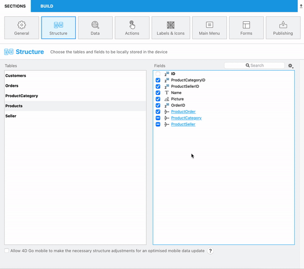
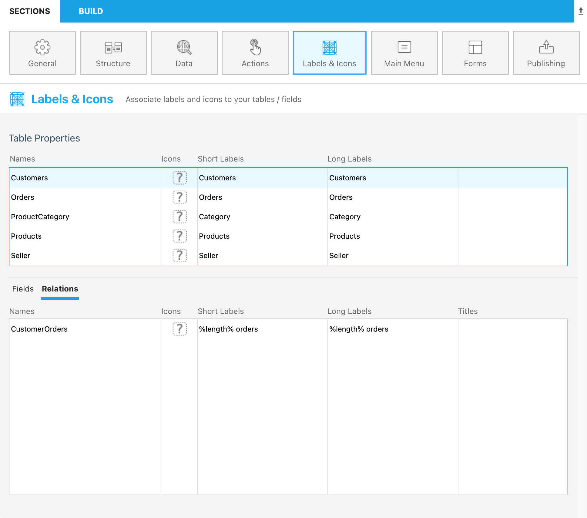
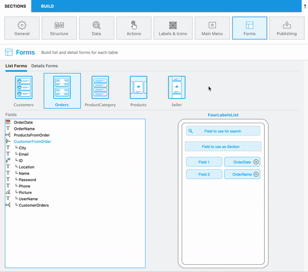
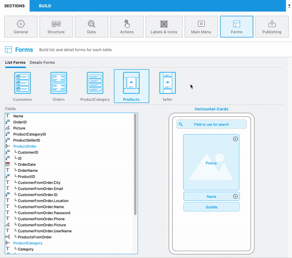
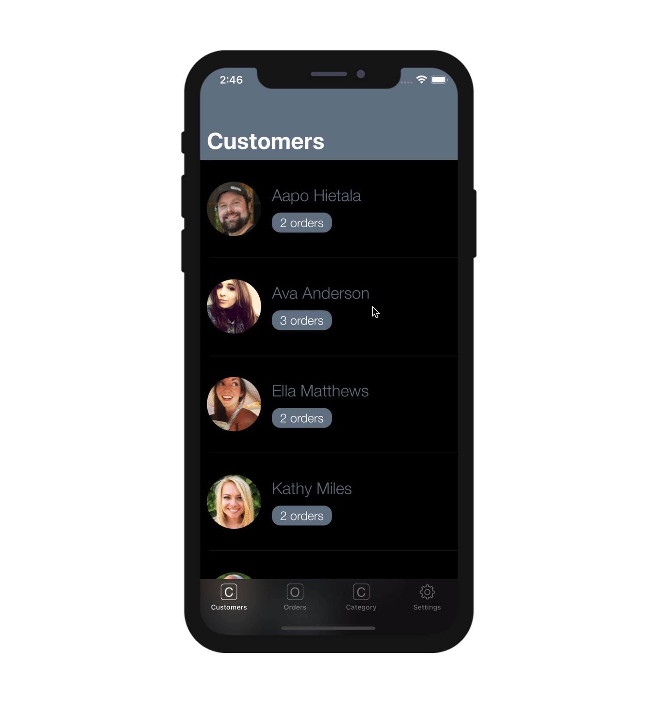
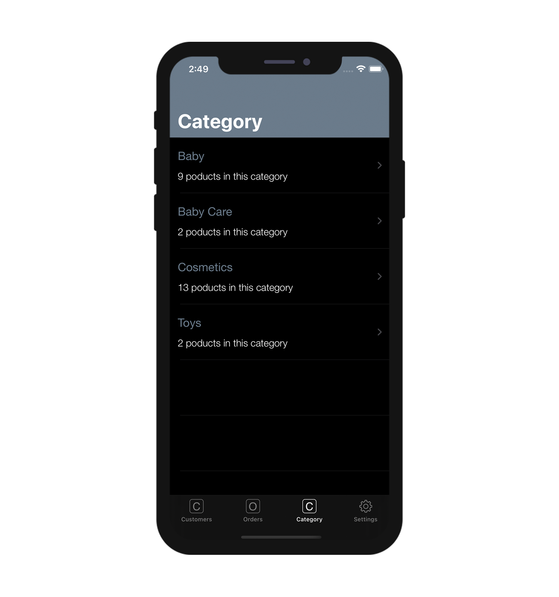

Projetos 4D móveis permitem adicionar interações agradáveis a seus aplicativos. Por exemplo pode publicar relações One to Many e Many to One a partir de uma relação[Many to one](many-to-one-relations.md).

# Editor de Projeto

## Structure section

A partir da seção estrutura, pode publicar relações a partir de uma relação Many to One de forma simples. Isso permite exibir por exemplo relações Many to Many em seu app iOS

## Labels & Icons section

Na seção Labels & Icons, pode personalizar sua etiqueta de botão relacões

### Obter o número de registros

Uma nova propriedade está disponível para exibir o número de registros que serão exibidos ao clicar em uma relação One to Many.

Para fazer isso apenas adicione %length% em sua etiqueta de relação longa ou curta para uma relação One to Many.

## Forms section

### Adicione qualquer relação onde quer que queira

Qualquer tipo de relação pode ser jogada no formulário Lista e Detalhe para adicionar interações e criar apps mais dinâmicos do que nunca!

### Torne seus campos clicáveis

Na seção formulários, pode fazer com que seus campos fiquem clicáveis ao soltar relações em um campo em formulários Lista ou em formulários Detalhe.

# App Gerado

Essas melhorias permitem adicionar intereações em seu app:

* Mova-se de um formulário lista para outro formulário lista ao invés de abrir um formulário detalhe para poder acessar outro formulário lista.

Neste exemplo acessamos a lista de ordens a partir da lista Ordens clicando em uma relação ONe to Many a partir do formulário Lista Clientes

* Exiba relações em seus formulários Lista para acessar os formulários Detalhe relacionados.

Nesse exemplo acessamos ao formulário detalhe Cliente, a lista Ordens e o formulário detalhe Ordens.

* Torne seu campo clicável adicionando uma relação N to One e exibindo número de registros graças a  %length%.

Nesse exemplo o número de produto para cada relação ONe to Many no formulário lista Categoria é exibido.

