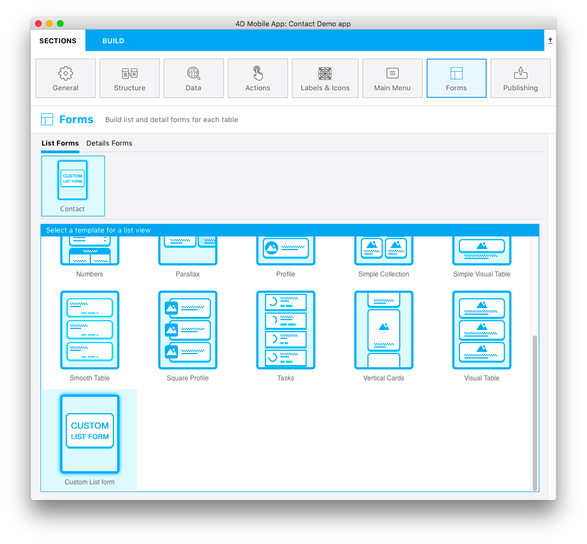

Pode criar seu próprio ícone para um modelo de lista formulário.

Deve ter 160x160 px e deve ser nomeado **layoutIconx2.png**.

O ícone será usado:

* acima do nome da tabela quando o modelo tiver sido selecionado, e
* na janela seleção de modelo na seção **Formulário**

Se este ícone estiver faltando na pasta de seu modelo de formulário lista, será exibido [**template.svg file**](list-form-template.md)será exibido na janela de seletor de modelo e um ícone de ponto de interrogação será exibido acima de cada tabela em que faltar um ícone.

Pode usar qualquer software de imagem para criar o ícone do modelo de formulário lista.

