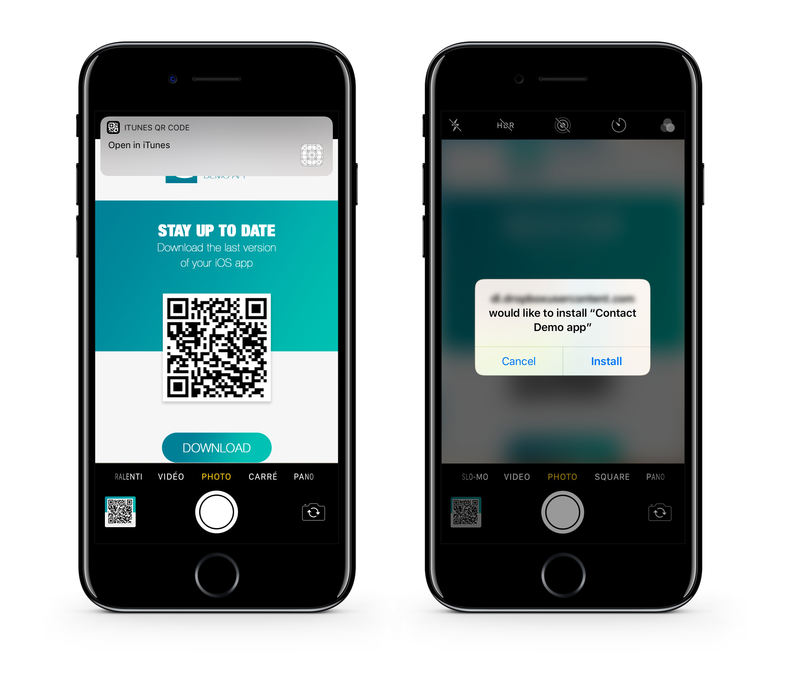

> **OBJETIVOS**
> 
> Suba sua aplicação para um servidor seguro.


## PASSO 1. Suba sua aplicação

Suba sua aplicação a um servidor seguro:

* Recursos (exibir imagem e imagem em tamanho real)
* arquivo `manifest.plist`
* arquivo `.ipa`

Pode usar qualquer serviço de armazenamento na nuvem para distribuir seu app logo que estiver protegida (Dropbox, Google Drive, etc).

:::nota

Seu recurso e suas URL ipa devem coincidir com as URL definidas em seu arquivo `manifest.plist`.

:::

## PASSO 2. Crie o link da instalação

Crie um **link de serviços ITMS**(iTUnes Music Store) com o endereço web completo de seu arquivo manifesto como parâmetro:

```html
itms-services://?action=download-manifest&url=https://mywebserver.com/manifest.plist

```

Esse link pode ser usado quando enviar emails, embebido na página html ou  mesmo em  um código QR.

Aqui um exemplo simples:


*O código QR usado por essa documentação não está ativo.*

## PASSO 3. Instale a sua aplicação em iOS

* Instale o app clicando no link ou escaneando o Código QR



* Quando abrir pela primeira vez um app empresarial que instalou manualmente, uma notificação será exibida que indica que o desenvolvedor da aplicação não é de confiança em seu dispositivo.

* Ignore essa mensagem e clique **Cancel**.

* Em Configurações > Geral > Gestão de perfis & Gestão de dispositivo, no cabeçalho "Enterprise App", se lista o perfil do desenvolvedor.


* Introduza o nome do perfil do desenvolvedor para seja reconhecido como confiável.


* Depois pode ir à sua aplicação e abri-la.

Parabéns... já pode distribuir sua primeira aplicação interna.
