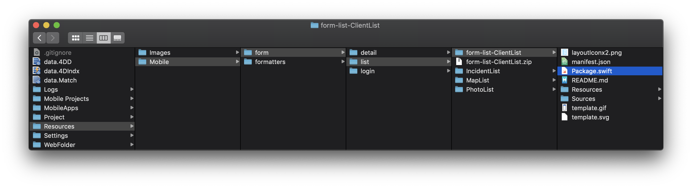
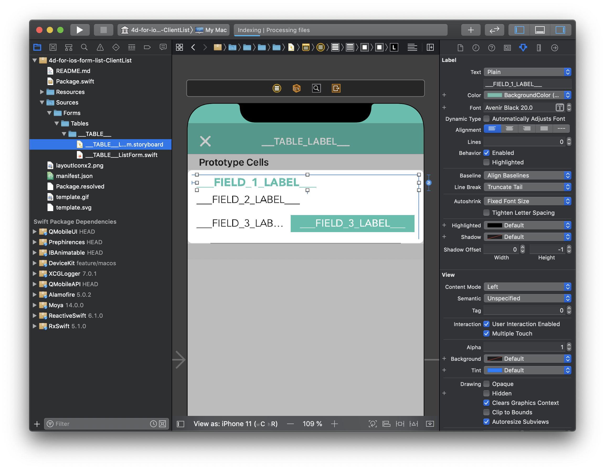

> **OBJETIVOS**
> 
> Abrir e atualizar um modelo da galeria e melhorá-lo

## Abrir um modelo

Para modificar um modelo que baixou da Galeria:

* A primeira coisa é ir para sua pasta *YourDatabase.4dbase/Resources/Mobile/form/list*.

* Desde aí, pode ver o modelo se o modelo que baixou já está disponível.
* Descompacte e abra o arquivo
* Dê um duplo clique no arquivo package.swirft.

* Ele se abrirá automaticamente em Xcode com todas as fontes para permitir modificar seu modelo.

## Atualize seu modelo

A partir daqui pode agregar código Swift e otimizar seu modelo storyboard.

Tão fácil de usar!

Vamos atualizar a cor e a fonte FIELD_1_LABEL usando o inspector de atributos.

Depois que fez suas melhorias no modelo, pode usar seu modelo novo selecionando-o no seletor de modelos de Formulário no editor de projeto.

## Compartilhar seu modelo

Quando seu modelo estiver pronto e já fez suas melhorias, talvez queira partilhá-lo.

Um botão de compartilhar está acessível diretamente na parte inferior do seletor de galeria de modelos!

Todo o processo de compartilhar é detalhado na página de contribuição para ajudar no processo de compartir, lá estão também listas de boas práticas.

## O que fazer agora?

Pode tentar seguir a [guia de contribuição](https://github.com/4d-go-mobile/gallery/blob/master/.github/CONTRIBUTING.md#how-do-you-add-a-package) para compartilhar seus modelos em github e fazer com que apareçam no editor de projetos.

