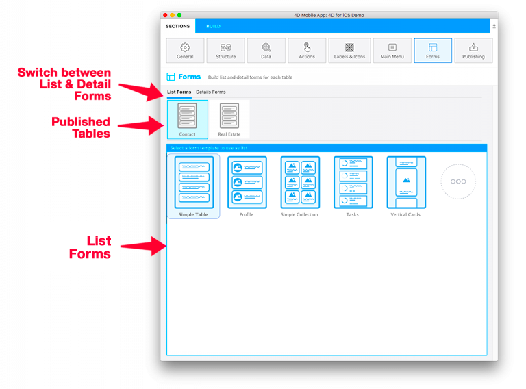
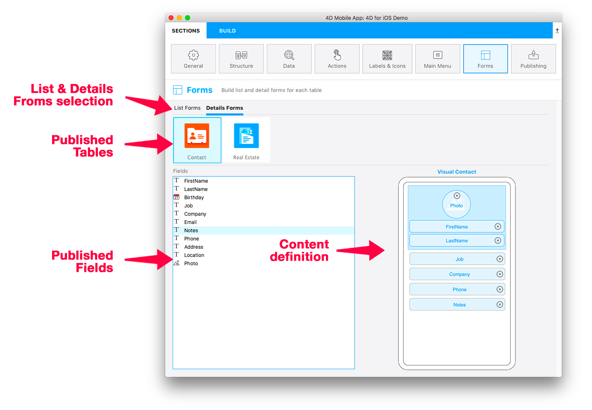

A página Formulários lhe permite selecionar os modelos de formulário Lista e de formulários detalhados para cada tabela publicada. Pode selecionar um formulário lista e um formulário detalhado por tabela publicada.

O editor móvel 4D oferece vários modelos com efeitos de transição personalizados para gerar aplicações móveis novas e modernas. Os modelos simples e vazios são usados de forma pré-determinada para os formulários Lista e os formulários de detalhados de uma aplicação.

Aqui está o detalhamento da tela, de cima para baixo:

* **Os formulários lista e os formulários detalhados:** permitem mudar entre definições de  formulários Lista e  formulários detalhados para cada tabela.
* **Tabelas publicadas:** Exibe todas as tabelas publicadas na seção  [Structure](structure.md)
* **Formularios:** lista de formularios disponibles. Permite  mudar entre a seleção de modelos e definição de conteúdos. Na área de definição de conteúdos se pode exibir dicas que oferecem informações adicionais nos campos de formulário.

## Formulários Lista

Quando seleciona um modelo de formulário lista para uma tabela, a tela de definição de conteúdo aparece. Depois pode arrastar e soltar os campos da lista diretamente no modelo mostrado à direita.

:::nota

Nos formulários lista não é possível adicionar mais campos do que aqueles incluídos no modelo.

:::

A maioria dos formulários lista incluem campos opcionais de **Search** e **Section**. Também pode ativar o  **escaneador de código de barra**.

### Pesquisa

Um campo de**pesquisa** permite filtrar dinamicamente a lista de conteúdos dependendo dos caracteres digitados.

#### Pesquisa multicritério

Pode soltar mais de um campo no campo de pesquisa - nesse caso o campo vai mostrar "Pesquisa multicriterio":

Nesse caso, o app vai pesquisar por caracteres digitados em todos os campos usando o operador "OR". Para remover um campo da lista, clique no botão apagar do campo de pesquisa para selecionar os campos a serem removidos:

### Seções

Um campo de seção vai agrupar e ordenar entidades na lista dependendo de seu valor para esse campo.

### Escaner de código de barras

Para ativar a pesquisa por código de barra, clique na lupa do lado do campo pesquisa e selecionea opção **Ativar escaner de código de barras**.

A pesquisa de código de barras permite duas funcionalidades:

* Filtrar um formulário lista escaneando um código de barras que contenha um valor texto. Isso preenche a Barra de Pesquisae abre o formulário detalhado se houver apenas um valor após a filtragem.
* Exibir formulários lista e detalhado apenas com o escaneamento de códigos de barras cujos valores são **URL Schemes** or **Universal Links** quando a funcionalidade [**deep linking**](../special-features/deep-linking.md) estiver ativada.

:::informação 4D for Android

This feature is currently not available in 4D for Android.

:::

## Formulários detalhados

Da mesma forma que com Formulários Lista, selecione um modelo e configure os campos. Em formulários detalhados é possível adicionar quantos campos quiser no formulário.

Você tem várias maneiras de adicionar seus campos nos formulários Detalhes:

* Pode arrastar e soltar os campos em qualquer parte na vista SVG para adicionar e exibir logo depois que o último campo tenha sido adicionado ou entre qualquer outros campos que já são exibidos.

* Dê duplo-clique no campo. Seu campo será adicionado ao final da lista.

* Dê um clique direito no campo disponível na tabela Campos à esquerda e selecione **Adicionar campos que faltam** do menu contextual.

Pode reordenar seus campos a qualquer momento usando arrastar e soltar no formulário detalhado.

:::dica

Se quiser tentar outro modelo depois de enviar seus campos, apenas selecione-os: campos selecionados previamente são movidos automaticamente para você para o novo modelo nas áreas apropriadas de acordo com o modelo e tipos de campos.

:::

## Galería

Quando selecionar um modelo na seção formulário um ícone "Mais" está disponível para formulários detalhados ou lista.

Clique nesse ícone para exibir uma lista de modelos adicionais da Galeria de 4D móvel:

A única coisa que precisa fazer é selecionar o modelo mais adequado às suas necessidades e o editor móvel vai gerenciar todo o processo de instalação. Portanto pode começar a trabalhar diretamente no modelo, já que é pronto para usar.

É mostrado um ícone github na parte superior esquerda de seu ícone de modelo no seletor de modelos Forms para indicar que vem de Github:

:::dica

A galeria está disponível diretamente em Github.
- [**galeria de modelos para formulários lista**](https://4d-for-ios.github.io/gallery/#/type/list-detail/picker/0)
- [**galeria de modelos para formulários detalhados**](https://4d-for-ios.github.io/gallery/#/type/form-detail/picker/0)

:::

## Criar seus modelos

Se quiser personalizar um modelo baixado ou criar seus modelos, há **vários tutoriais** para guiá-lo nessas tarefas:

- [**Personalizar um formulário modelo**](../tutorials/gallery/update-gallery-template.md)
- [**Criar formulários lista**](../tutorials/creating-list-forms/list-form-template.md)
- [**Criar formulários detalhados**](../tutorials/creating-detail-forms/detail-form-template.md)