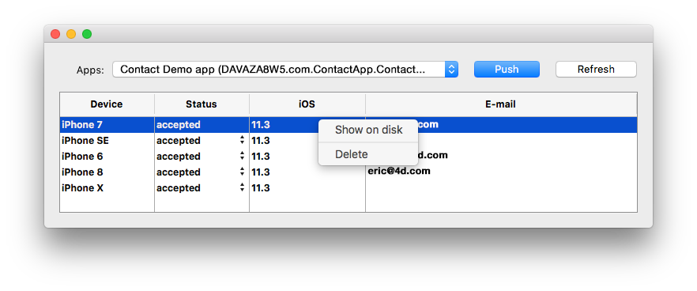

## Arquivo de sessão

When a user opens the app for the first time, a session file is created and stored next to the current data file in the MobileApps folder.

The session files are organized and grouped by app folder. The Team ID and app bundle ID are concatenated to create the app folder names.

Here is an example of a 4D for iOS-generated session file:

```json
{
"application":{
  "id":"com.contactApp. Contact",
  "name":"Contact",
  "version":"1.0.0"
},
"team":{
  "id":"UTT7VDX8W5"
},
"language":{
  "id":"en_US",
  "code":"en",
  "region":"US"
},
"email":"",
"device":{
  "description":"iPhone X",
  "version":"11.3",
  "id":"0DC5132E-1EF4-407C-A832-5FE33D818AF3",
  "simulator":true
},
"send":"link",
"session":{
  "id":"7023d9205074199d1c16fc00d24354e778137675",
  "ip":"::ffff:192.168.5.4"
},
"status":"accepted",
"token":"eyJhcHBOYW1lSUQiOiJjb20uY29udGFjdEFwcC5Db250YWN0IiwiaWQiOiI3MDIzZDkyMDUwNzQxOTlkMWMxNmZjMDBkMjQzNTRlNzc4MTM3Njc1IiwidGVhbUlEIjoiVVRUN1ZEWDhXNSJ9"
}

```

If you want the ability to manually validate the first login for every user session, you must change the "accepted" default status to "pending" by adding `$response.verify:=True` to the [*On Mobile App Authentication*](https://doc.4d.com/4Dv19/4D/19/On-Mobile-App-Authentication-database-method.301-5392844.en.html) database method.


## Mobile Session Management Component

Sessions can be managed by the **Mobile Session Management** component:

<div>
<a className="button button--primary"
href="https://github.com/4d/Mobile-Session-Management/releases/latest">Componente Mobile Session Management</a>
</div>

1. Descarregue e descomprima o arquivo zip
2. Vá para o arquivo Gerar/Componentes e obtenha o arquivo MOBILE SESSION MANAGEMENT.4dbase
3. Crie uma pasta **Componentes** junto ao banco de dados 4D com os dados da aplicação.
4. Coloque o componente **MOBILE SESSION MANAGEMENT** na pasta **Componentes** recém criada.
5. Reinicie 4D.
6. Clique no botão **Executar** a partir da barra de ferramentas
7. No explorador de métodos 4D, selecione o método **MOBILE SESSION MANAGEMENT** e clique no botão **Executar**.
8. A janela de aplicações aparecerá mostrando todas suas aplicações:


* Right click on a session to reveal the session file in the Finder or delete it.
* You can change and define the session status for each device: accepted or pending




* The **Push** button will update the session in memory.
* The **Refresh** button updates the session list. 


