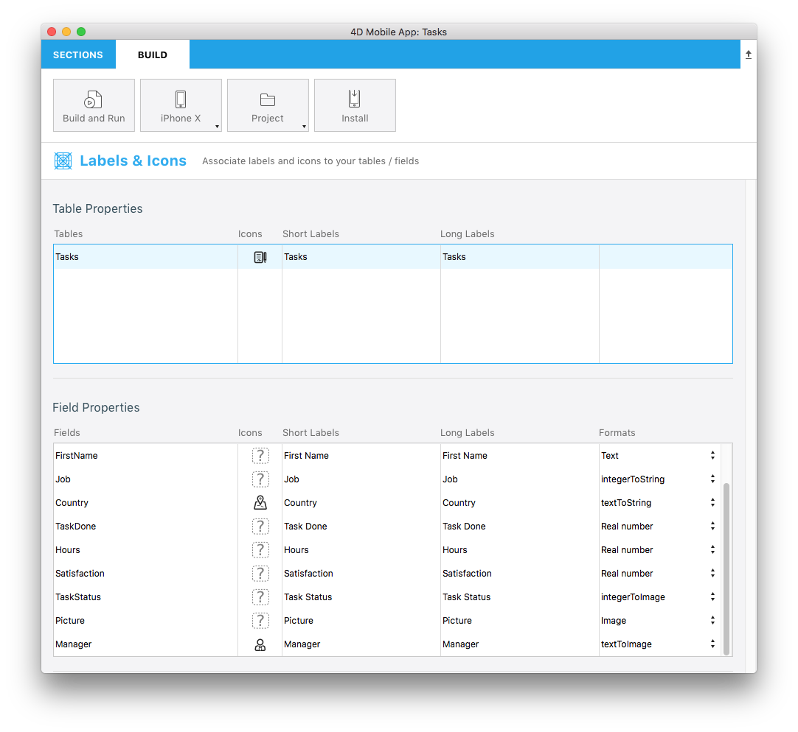

> **OBJETIVOS**
> 
> Criar seus primeiros formatos de dados.

> **PRÉ-REQUISITOS**
> 
> Click [here](requirements.html) to see what you'll need to get started!

Neste tutorial, vamos guiá-lo através da criação de vários exemplos de formatador.


From the **Labels & Icons** section, you can choose pre-packaged formats.

> **Formatos disponíveis:**
> 
> * **Texto**: Texto
> * **Data**: Data, data curta, data longa, data completa
> * **Hora**: hora, hora curta, duração, número inteiro
> * **Booleano**: "Não" ou "Sim", "False" ou "True"
> * **Número inteiro**: número inteiro, número decimal, porcentagem, número ordinal, moeda  $, Moeda €, Moeda ¥, número em letras

Vamos começar baixando o Projeto Starter:

<div className="center-button">
<a className="button button--primary"
href="https://github.com/4d-go-mobile/tutorial-DataFormatter/releases/latest/download/tutorial-DataFormatter.zip">Baixar</a>
</div>

## Baixe o Starter Project

Para começar, baixe o **Starter Project**, que inclui:

* Pastas**integerToImage_Images** e **textToImage_Images** que contêm imagens (para usar mais tarde para formatadores que incluem imagens)
* Um arquivo de **Task Management.4dbase** (com um projeto de app móvel pronto para usar)

<div className="center-button">
<a className="button button--primary" href="https://github.com/4d-go-mobile/tutorial-CustomDataFormatter/archive/66d7eea49bc3353f73dbf784ee06283b3a332d0b.zip">Starter project</a>
</div>

Agora você já está pronto para criar seus primeiros formatadores!

## Crie a pasta formatadores

Primeiro, crie uma pasta *Task Management.4dbase/Resources/Mobile/formatters *.


## Formatadores de inteiros

### Número inteiro para string

* Crie uma pasta ** integerToString **na pasta formatadores, que você acabou de criar.
* Em seguida, crie um arquivo **manifest.json ** na pasta **integerToString**.


Vamos olhar o conteúdo do arquivo de**manifest.json **:

```json
{
   "name": "integerToString",

   "type": ["integer"],

   "binding": "localizedText",

   "choiceList": {"0":"UX designer","1":"Developer","2":"QA","3":"Product Owner"}
}
```

1. **nome**: o nome do formatador
2. **tipo**: o tipo de formatador 4D você deseja usar
3. **binding**: pode ser **texto localizado** para strings de caracteres ou **imageNamed** para imagens
4. **choiceList**: valores mapeados

### Inteiro para imagem

* Crie uma pasta ** integerToString **na pasta  **formatadores **, que você acabou de criar.

* Em seguida, crie um arquivo de**manifest.json ** na pasta **integerToImage**.


* Em seguida, crie uma pasta** Imagens** na pasta **IntegerToImage**. Pode adicionar as imagens de **IntegerToImage_Images ** em StarterProject.zip para a nova pasta.


Vamos olhar o conteúdo do arquivo de**manifest.json **:


```json
{
   "name": "integerToImage",

   "type": ["integer"],

   "binding": "imageNamed",

   "choiceList": {"0":"todo.png","1":"inprogress.png","2":"pending.png","3":"done.png"},

   "assets": {
      "size": {
         "width": 40, "height": 40
      }
   }
}
```
1. **nome**: o nome do formatador
2. **tipo**: o tipo de formatador 4D você deseja usar
3. **binding**: pode ser **texto localizado** para strings de caracteres ou **imageNamed** para imagens
4. **choiceList**: valores mapeados
5. **assets**: ajusta o tamanho do display (largura e altura)

## Formatadores de Texto

### Texto para string

* Crie uma pasta ** textToString **na pasta formatadores, que você acabou de criar.

* Crie um arquivo de **manifest.json ** na pasta **textToString**.


Vamos olhar o conteúdo do arquivo de**manifest.json **:

```json
{
   "name": "textToString",

   "type": ["text"],

   "binding": "localizedText",

   "choiceList": {"FRA":"France","MAR":"Morocco","USA":"United States","AUS":"Australia"}
}
```

1. **nome**: o nome do formatador
2. **tipo**: o tipo de formatador 4D você deseja usar
3. **binding**: pode ser **texto localizado** para strings de caracteres ou **imageNamed** para imagens
4. **choiceList**: valores mapeados

### Texto para Imagem

* Crie uma pasta ** textToImage **na pasta formatadores, que você acabou de criar.

* Crie um arquivo de**manifest.json ** na pasta **textToImage**.


* Em seguida, crie um arquivo de** Imagens** na pasta **textToImage**. Pode adicionar as imagens de **textToImage_Images ** em StarterProject.zip para a nova pasta.


Vamos olhar o conteúdo do arquivo de**manifest.json **:

```json
{
   "name": "textToImage",

   "type": ["integer"],

   "binding": "imageNamed",

   "choiceList": ["image1.png","image2.png","image3.png"],

   "assets": {
  "size": {
   "width": 40, "height": 40
      }
   }
}

```

## Compatibilidade modo Escuro

Se seu dispositivo estiver no modo claro ou escuro, não importa se trabalhar em Android ou iOS, pode facilmente usar os formatadores de dados personalizados contendo imagens. As imagens se adaptarão dependendo do modo de cor do telefone.

### Cor tintado

Para otimizar o contraste de cores em suas imagens branco e preto em seu app dependendo do modo de cor (claro ou escuro) pode estabelecer as imagens da seguinte forma, com a linha de código `"tintable": true` :

```json
{
   "name": "textToImage",
   "type": ["text"],
   "binding": "imageNamed",
   "choiceList": {"car":"car.png","plane":"plane.png","bus":"bus.png"},
   "assets": {
     "size": 54, 
     "tintable": true
     }
}
```
Este é o resultado nos modos claro e escuro:

| Modo Claro                               |               Modo Escuro               |
| ---------------------------------------- |:---------------------------------------:|
|  |  |


### Imagens a cor otimizadas

Para otimizar as imagens de cor que são mostradas em sua aplicação e adaptá-las a seu modo de cor, necessita ter duas imagens, uma para o modo claro e outra para o modo escuro com o sufixo `_dark`, como abaixo:


```json
{
   "name": "textToImage",
   "type": ["text"],
   "binding": "imageNamed",
   "choiceList": {"car":"car.png","plane":"plane.png","bus":"bus.png"},
   "assets": {
     "size": 54
   }
}
```
Este é o resultado nos modos claro e escuro:

| Modo Claro                                  |                Modo Escuro                 |
| ------------------------------------------- |:------------------------------------------:|
|  |  |

## Abrir projeto móvel

Abra Task Management.4dbase com 4D e vá para File > abra > Mobile Project... para abrir **Tasks**

Agora, vá para a seção **Labels & Icons** no editor de projetos. Todos os formatadores estão disponíveis para os tipos de campo diferentes que você definir previamente nos arquivos manifest.json de diferentes  formatadores:

* Selecione o formatador de**integerToString ** para o **campo Job**
* Selecione o formatador de** textToString** para o **campo Country**
* Selecione o formatador ** integerToImage** para o **Task Status**
* Selecione o formatador ** textToImage** para o **Manager**



## Construa seu app 4D for iOS

Construa seu app 4D de iOS e você verá que o formatador de dados é bem aplicado dependendo do limite de crédito.


Baixe a pasta do modelo de formatador completo:

<div className="center-button">
<a className="button button--primary" href="https://github.com/4d-go-mobile/tutorial-CustomDataFormatter/releases/latest/download/tutorial-CustomDataFormatter.zip">Baixar</a>
</div>

And you're done! 
