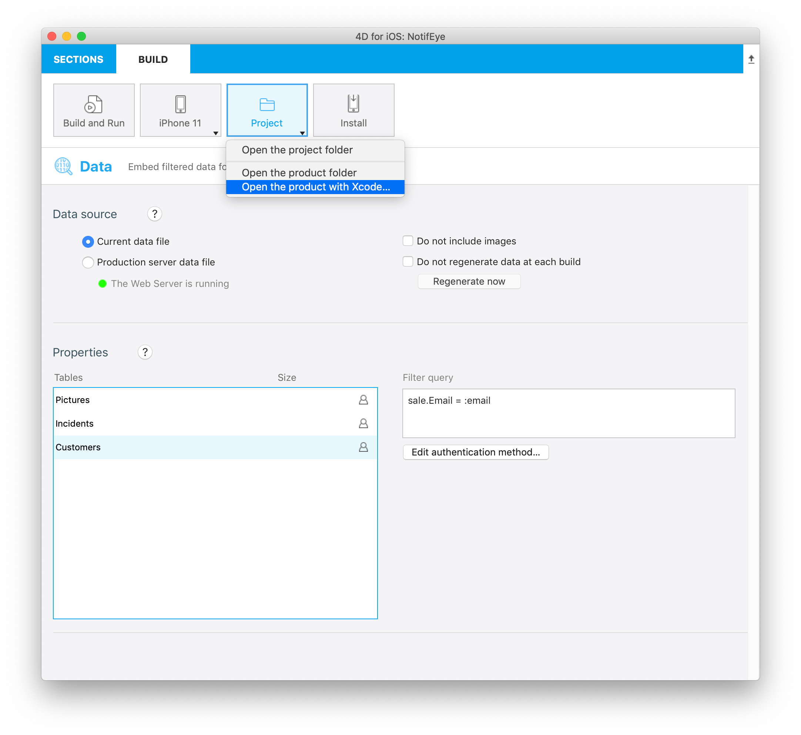
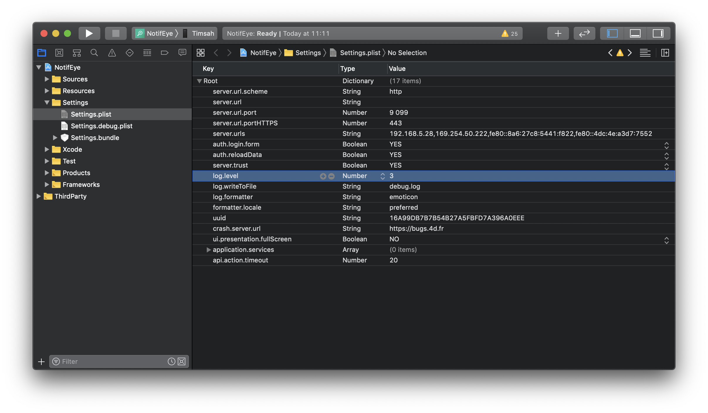
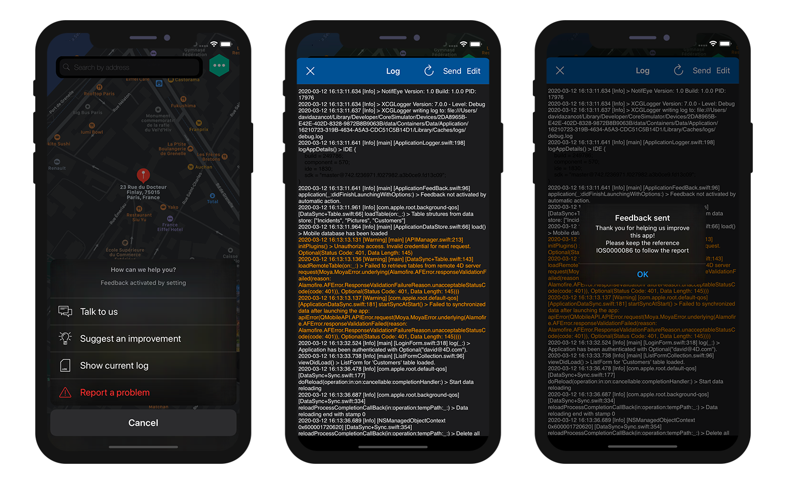

## Debug from Xcode
Se tiver problemas durante o processo de compilação pode abrir seu projeto gerado com Xcode selecionando a opção **Open the product with Xcode** a partir do menu **Project**.

A partir daí é possível **lançar sua aplicação** no Simulator clicando no botão **Build** e obter todo o histórico no fundo do espaço de trabalho de Xcode.

### Logger (registrador)

Um logger é um objeto que permite registrar o log e rastrear.

Para isso usamos [XCGLogger](https://github.com/DaveWoodCom/XCGLogger) .

Vai encontrar a definição dos parâmetros do logger em  Xcode project/Settings/Settings.plist.

### Níveis

Pode filtrar e exibir diferentes níveis do log em seu console, adicionando o log.level em seu arquivo Settings.plist.

Para fazer isso, adicione uma folha dando um clique direito dentro do arquivo Settings.plist e entre:
* log.level como Key
* Number como Type
* 3 como Value (por exemplo)

Os **valores disponíveis** são os abaixo:

* 0 para verbose
* 1 para debug
* 2 para info (valor normal)
* 3 aviso
* 4 erro
* 5 severo

Para este exemplo, se estabelecer o valor de log.level para 3, vai obter **um aviso, um erro e severidade** no console  Xcode.

### Formato

Pode exibir indicadores visuais diferentes no console Xcode para **ressaltar diferentes tipos de log**.

Para fazer isso, precisa abrir  Xcode project/Settings/Settings.plist

#### Emoticons

 * prefixes[.verbose] = "🗯"
 * prefixes[.debug] = "🔹"
 * prefixes[.info] = "ℹ️"
 * prefixes[.warning] = "⚠️"
 * prefixes[.error] = "‼️"
 * prefixes[.severe] = "💣"

#### Círculos

* prefixes[.verbose] = "🔘"
* prefixes[.debug] = "🔵"
* prefixes[.info] = "⚪"
* prefixes[.warning] = "☢️"
* prefixes[.error] = "🔴"
* prefixes[.severe] = "⚫"

## Debug from your iPhone

From your app, if you have a crash, you can display, edit and send feedback.

Para isso:
* Vá para configurações no seu IPhone
* encontre sua aplicação indo para baixo
* ative os comentários (feedback)

A partir daqui, a única coisa que precisa fazer é reabrir sua aplicação. Uma folha de ação vai aparecer que vai permitir:
* Enviar mensagens
* Sugerir uma melhoria
* Mostrar o histórico atual
* Relatar um problema

