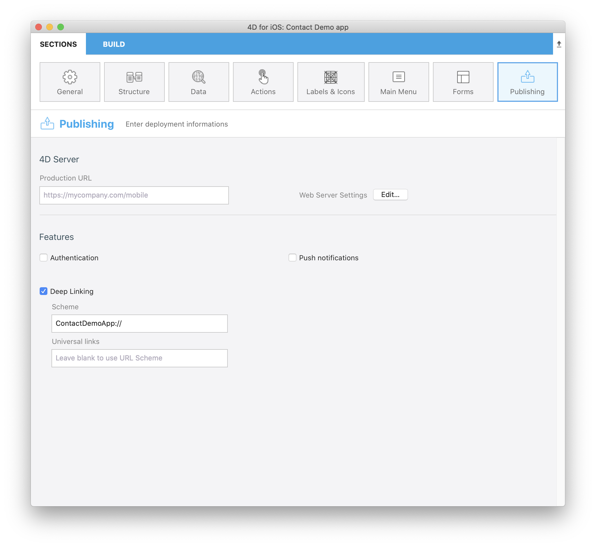

Thanks to the **deep linking** feature, you can share the content that you're currently viewing with all of your colleagues. Here's an illustration demonstrating deep linking:


There are two ways to implement deep linking in mobile apps: **URL scheme** and **Universal Links**. While URL schemes are a well-known method for deep linking, Universal links are the new way that Apple has implemented to easily connect your webpage and your app under the same link.


## Comparação de modos deep linking

Here is a comparison between the two options which are available in the project editor:

### URL Scheme

| PRÓS                                | CONTRAS                                           |
| ----------------------------------- | ------------------------------------------------- |
| Fácil de implementar                | Sempre requer permissão                           |
| Não precisa de um backend adicional | Não funciona se a aplicação não estiver instalada |

### Universal links

| PRÓS                                | CONTRAS                                  |
| ----------------------------------- | ---------------------------------------- |
| Não requer permissão                | Se necessita um backend estático com SSL |
| Não abre o navegador                | Mais complexo de implementar             |
| Fallback URL if app isn't installed |                                          |

## Esquema URL personalizado

At the simplest level, URL schemes allow users to open an app from other apps. But the true power of URL schemes is in the ability to perform specific actions as your app opens.


### Esquema de URL personalizado no editor de projeto

It's very simple to include an URL scheme to your mobile app. Let's see an example:

1. Selecione a ação predefinida **Share** da página [**Action**](../project-definition/actions.md) e selecione o alcance:
    *   entidade - para compartilhar o conteúdo de um formulário detalhado
    *   tabela - para compartilhar um formulário lista
2. Marque a propriedade **Deep Linking** na seção **Publishing** do editor de projetos.
3. A informação do esquema URL é preenchido automaticamente com o nome da aplicação definida previamente na página [**General**](../project-definition/general.md). Entretanto, ainda pode ser editado:



4. Preencha seu método **On Mobile App Action**:

```4d

// On Mobile App Action database method

var $1 : Object  // Informação fonrecida por aplicação móvel
var $0 : Object  // Informação retornada para aplicação móvel

var $action : Object
$action:=MobileAppServer. Action.new($1) Case of 

    : ($1.action="shareContact")

        $0:=$action.shareContext()

    Else 

        $0:=New object("success"; False;"statusText"; "Unknown action send to server") End case 

```

5. Criação da aplicação.


### Usar esquemas URL em seu app móvel

1. Clique no botão **Action** para mostrar todas as suas ações disponíveis atualmente
2. Selecione a ação **Share** que foi previamente definida no editor de projetos
3. Aparece uma nova vista que lhe permite começar a compartilhar o conteúdo
4. Selecione o método de intercâmbio que quiser utilizar
5. Envie.

## Universal links

Universal links provide several key benefits that aren't available with custom URL schemes. Specifically, universal links are:

* **Unique**: Diferente de schemes personalizados de  URL , links universais não podem ser reclamadas por outros apps porque usam links padrão  HTTP ou HTTPS para seu website.

* **Secure**: When users install your app, iOS or Android verifies that your website allows your app to open URLs on its behalf. Só você pode criar e subir o arquivo que outorga esta permissão a seu servidor web, pelo que a associação de seu website com sua aplicação seja segura.

* **Flexible**: os links universais funcionam mesmo quando sua aplicação não estiver instalada. In this case, tapping a link to your website opens the content in a browser.

* **Simple**: uma única URL funciona tanto para seu site web quanto para sua aplicação.

* **Private**: outras aplicações podem se comunicar com sua aplicação sem necessidade de saber se sua aplicação estiver instalada.

### Links universais no Editor de Projeto

To include Universal links into your app, the process is quite similiar to the URL Schemes process:

1. Selecione a ação predefinida **Share** da página [**Action**](../project-definition/actions.md) e selecione o alcance:
    *   entidade - para compartilhar um conteúdo de um formulário detalhado
    *   tabela - para compartilhar um formulário lista
2. Ativar a funcionalidade **Deep Linking** na seção **Publishing** no editor de projetos
3. Introduza a URL de seu site web no campo **Universal links**
4. Preencha seu método **On Mobile App Action**:

```4d

// On Mobile App Action database method

var $1 : Object  // Informação fonrecida por aplicação móvel
var $0 : Object  // Informação retornada para aplicação móvel

var $action : Object
$action:=MobileAppServer. Action.new($1) Case of 

    : ($1.action="shareContact")

        $0:=$action.shareContext()

    Else 

        $0:=New object("success"; False;"statusText"; "Unknown action send to server") End case 

```

5. Criação da aplicação.
6. Ativar os links universais do método **On Web Connection**:

```4d
// Método de banco On Web Connection

var $1; $2; $3; $4; $5; $6 : Text
var $handler : Object

$handler:=MobileAppServer. WebHandler.new()
Case of
    : ($handler.handle($1; $2; $3; $4; $5; $6))
        // Gerenciado por código móvel normal
    Else
        // Seu código web End case

```

:::nota

To create a universal link, make sure you use standard ports (80 or 443).

:::

## Deep Linking e notificações Push

Algo genial sobre Deep Linking é que é completamente compatível com [notificações push](push-notification.md). Isso significa que pode enviar links Deep a seus usuários e levá-los diretamente à página correta.

Como pode ver, essa funcionalidade abre uma grande gama de possibilidades. Deep linking é uma funcionalidade crucial nas aplicações de hoje em dia, especialmente já que os usuários consumem o conteúdo mais rapidamente. Esta funcionalidade leva diretamente ao lugar desejado. Assim é recomendado que usem isso em seus apps móveis.

:::dica

Refer to the [**4D Mobile App Server** component documentation](https://github.com/4d/4D-Mobile-App-Server/blob/main/Documentation/Classes/PushNotification.md) for more information on how to combine push notifications and deep linking.

:::


