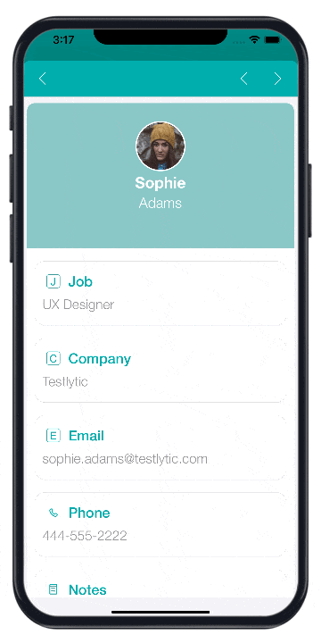

:::informação 4D for Android

This section is currently not available in 4D for Android.

:::

## O que é uma notificação push?

On a mobile phone, a push notification is an alert message, received via an application, that you can open, delete, allow or block. It can be very useful for example to notify your app users that a new version is available.

But what about the architecture to implement, in order to integrate this functionality into a mobile application? And what is the process of a push notification, from creation to display on the user's mobile?

## Arquitetura técnica

Esses são os elementos diferentes necessários para criar, enviar e receber uma notificação push móvel:


## Pré-requisitos

Para enviar notificações push, é necessário um arquivo de autenticação  `AuthKey_XXXYYY.p8` 8 da Apple.

1. Gerar e baixar um arquivo chave .p8 está descrito [nesta documentação](https://github.com/4d-for-ios/4D-Mobile-App-Server/blob/master/Documentation/Generate_p8.md).

2. Na página [Publishing](../project-definition/publishing) marque a opção **Push notifications** e selecione seu certificado no projeto móvel.


## Exemplo básico para gerenciar suas notificações push

O componente [4D Mobile App Server](https://github.com/4d-for-ios/4D-Mobile-App-Server/tree/master) fornece métodos para notificações push para um ou múltiplos recebedores. Para informações detalhadas, veja a documentação de componente [PushNotification ](https://github.com/4d-for-ios/4D-Mobile-App-Server/blob/master/Documentation/Classes/PushNotification.md).

Here is a simple example of push notification sent to `test@4d.com`:

```4d

$pushNotification:=MobileAppServer. PushNotification.new() 
$notification:=New object 
$notification.title:="Este é o título" 
$notification.body:="Aqui é o conteúdo da notificação" 
$response:=$pushNotification.send($notification;"test@4d.com")

```

It's as simple as that!

:::dica

Veja a documentação [**4D Mobile App Server** ](https://github.com/4d-for-ios/4D-Mobile-App-Server/blob/master/Documentation/Classes/PushNotification.md) para saber mais sobre como adaptar notificações push para suas necessidades. Feel free to use it and to pick the most relevant aspects for your app. And of course, all contributors are welcome to this project, through feedback, bug reports and even better: pull requests.

:::

## Empurrar notificações com sincronização de dados

With a push notification, you can also launch a synchronization to update your data.

For example, if your application has a delivery tracking option, the delivery information will be updated in the database thanks to a notification sent to the customer. This notification, containing a request to synchronize the data, will enable the customer to get the modified data on their smartphone.

To do so using the `4D Mobile App Server` component, you need to specify whether or not you want to force data synchronization in your push notification. Therefore, simply provide the `dataSynchro` boolean value in the `userInfo` object.

### Data synchronization with a notification opening a record

By default, a notification opening a record automatically triggers a data synchronization.

For example, in a Contact app, if a contact’s specific information (*i.e.* a contact’s record, such as the address or the phone number) has been modified, the user receives a notification that automatically opens the relevant record and synchronizes the data contained in the record. When the user opens the notification, the contact’s information is fully updated.

Here's an example of the default behaviour, a `dataSynchro` request with the `open()` method:

:::nota

For `open()` method exclusively, this is the default behaviour. As a result, if you don't specify the `dataSynchro` boolean value, it is `true` by default.

:::

```4d

$pushNotification:=MobileAppServer. PushNotification.new()

$notification:=New object
$notification.title:="This is title" 
$notification.body:="Here is the content of this notification" 

$entity:=ds. Employees.get("456456")
$response:=$pushNotification.open($entity; $notification; $recipients)

```

However, you can also choose not to force a data synchronization, by preventing `dataSynchro`:

```4d

$pushNotification:=MobileAppServer. PushNotification.new()

$notification:=New object
$notification.title:="This is title" 
$notification.body:="Here is the content of this notification" 
$notification.userInfo:=New object("dataSynchro"; False)

$entity:=ds. Employees.get("456456")
$response:=$pushNotification.open($entity; $notification; $recipients)

```

### Data synchronization with a simple notification

You can also request a synchronization for a simple notification without opening a specific record. For example, some new entries have been added. You can then inform your user and update the data with no manipulation on their part.

Here is a code example that you can also use with other methods, as long as you fill the `userInfo` object with `dataSynchro` value.

```4d

$pushNotification:=MobileAppServer. PushNotification.new()

$notification:=New object
$notification.title:="This is title" 
$notification.body:="Here is the content of this notification" 
$notification.userInfo:=New object("dataSynchro"; True)

$response:=$pushNotification.send($notification; $recipients)

```


## Configuração Windows

Windows users need to download the [last CURL version](https://curl.se/download.html) to work on the variables of the environment of their machine. Or they can insert curl.exe in the Resources folder of their production database.

## Pasta MobileApps

Whether you're working on Windows or on macOS, you need to copy the following files from your development project to your production project:

- `4DBASE/MobileApps/ID.BundleID/AuthKey_XXXX.P8`
- `4DBASE/MobileApps/ID.BundleID/manifest.json`


