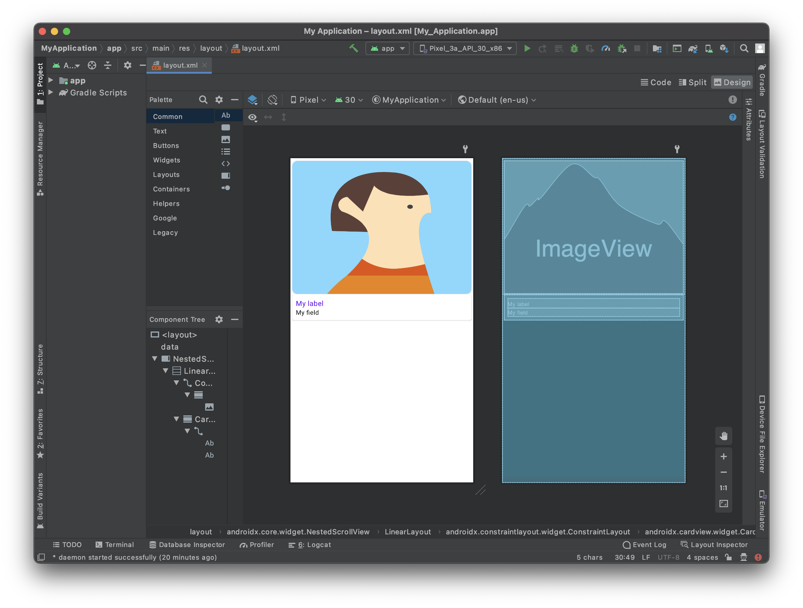
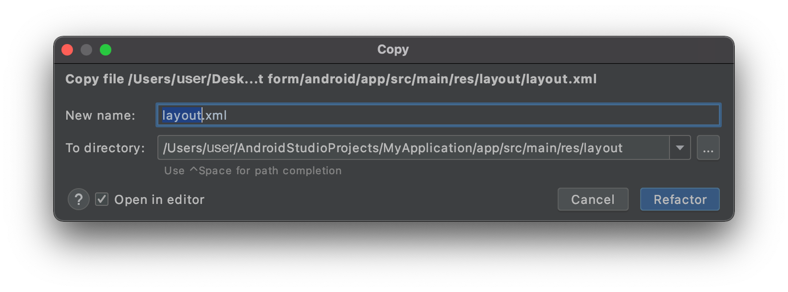
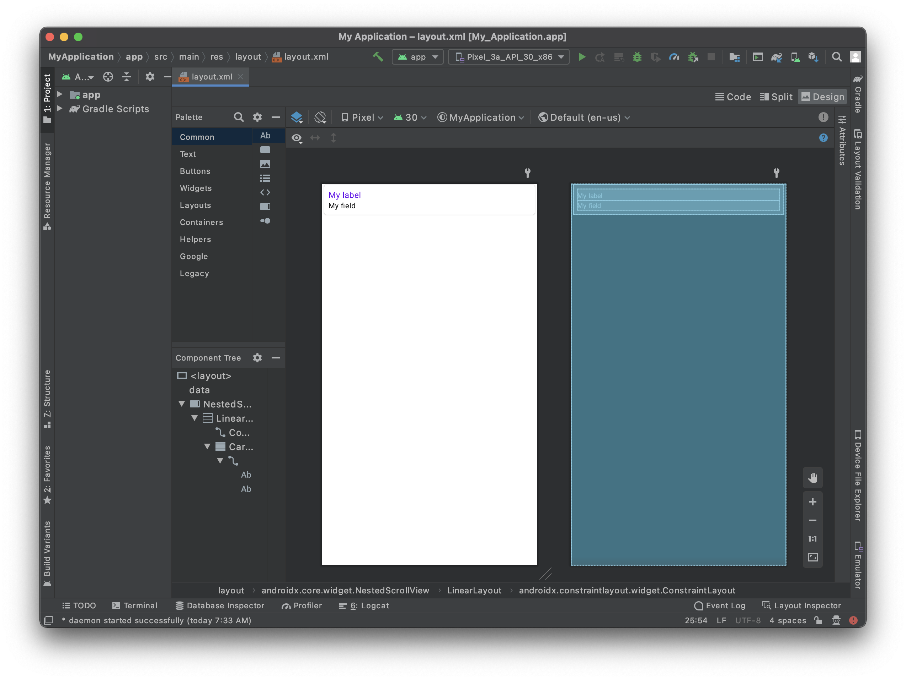

Nessa seção veremos como criar sua interface de formulário detallhado com Android Studio.

Aqui está o resultado que queremos atingir:




Para este modelo, vamos adicionar:

* Foto de perfil no cabeçalho
* Um campo a duplicar

## Abrir um arquivo layout com Android Studio

A melhor forma de editar ou criar um modelo é:

* Abrir o Studio Android e criar um novo projeto móvel vazio clicando no Arquivo > New > New Project...

* Selecionar o modelo Empty Activity


* Configure seu projeto e clique em  **Finish**


* Copie o arquivo layout.xml no layout app > res > soltando diretamente na pasta de layout de projeto



* Nesse ponto deve ter:



* Clique na opção direita superior**Split** para visualizar a visualização do modeloassim como código xml.

Está vazio, então vamos adicionar conteúdo!


## O que está disponível no projeto starter

Para que a vista seja rolável, uma scrollview já é incluída no layout:

```xml
    <androidx.core.widget. NestedScrollView
        android:layout_width="match_parent"
        android:layout_height="match_parent"
        android:fillViewport="true">

```

A parte que vai ser duplicada:

```xml
 <androidx.cardview.widget. CardView
                android:layout_width="match_parent"
                android:layout_height="wrap_content"
                android:layout_gravity="center"
                android:layout_marginHorizontal="4dp"
                android:layout_marginVertical="2dp"
                card_view:cardCornerRadius="4dp">

                <androidx.constraintlayout.widget. ConstraintLayout
                    android:layout_width="match_parent"
                    android:layout_height="wrap_content">

                    <TextView
                        android:id="@+id/__LABEL_ID__"
                        android:layout_width="0dp"
                        android:layout_height="wrap_content"
                        android:layout_marginStart="8dp"
                        android:layout_marginTop="8dp"
                        android:layout_marginEnd="8dp"
                        android:scrollbars="none"
                        android:text="__LABEL__"
                        android:textAppearance="@style/TextAppearance. Body1"
                        android:textColor="?colorPrimary"
                        app:layout_constraintBottom_toTopOf="@+id/__VALUE_ID__"
                        app:layout_constraintEnd_toEndOf="parent"
                        app:layout_constraintStart_toStartOf="parent"
                        app:layout_constraintTop_toTopOf="parent"
                        tools:text="My label" />

                    <!--IF_IS_IMAGE-->
                    <!-- IF THE DROPPED FIELD IS AN IMAGE -->
                    <ImageView
                        android:id="@+id/__VALUE_ID__"
                        android:layout_width="0dp"
                        android:layout_height="wrap_content"
                        android:layout_marginStart="8dp"
                        android:layout_marginTop="8dp"
                        android:layout_marginEnd="8dp"
                        android:layout_marginBottom="8dp"
                        android:contentDescription="Image"
                        app:imageUrl="__IMAGE__"
                        app:layout_constraintBottom_toBottomOf="parent"
                        app:layout_constraintEnd_toEndOf="parent"
                        app:layout_constraintStart_toStartOf="parent"
                        app:layout_constraintTop_toBottomOf="@+id/__LABEL_ID__" />

                    <!--END_IF_IS_IMAGE-->
                    <!--IF_IS_NOT_IMAGE-->
                    <!-- IF THE DROPPED FIELD IS NOT AN IMAGE, THEN IT WILL BE A TEXT VIEW -->

                    <TextView
                        android:id="@+id/__VALUE_ID__"
                        android:layout_width="0dp"
                        android:layout_height="wrap_content"
                        android:layout_marginStart="8dp"
                        android:layout_marginEnd="8dp"
                        android:layout_marginBottom="8dp"
                        android:scrollbars="none"
                        android:text="__TEXT__"
                        android:textAlignment="textStart"
                        android:textAllCaps="false"
                        android:textAppearance="@style/TextAppearance. Body2"
                        android:textColor="?colorOnSurface"
                        app:layout_constraintBottom_toBottomOf="parent"
                        app:layout_constraintEnd_toEndOf="parent"
                        app:layout_constraintStart_toStartOf="parent"
                        app:layout_constraintTop_toBottomOf="@+id/__LABEL_ID__"
                        tools:text="My field" />
                    <!--END_IF_IS_NOT_IMAGE-->

                </androidx.constraintlayout.widget. ConstraintLayout>

            </androidx.cardview.widget.
```


## Adicione uma "Image View"

Para ter uma boa exibição de Imagem vamos usar um container CardView. O último passo é agregar uma borda arredondada para a Image View para ter um melhor design

```xml
    <androidx.cardview.widget. CardView
                    android:id="@+id/cardview"
                    android:layout_width="match_parent"
                    android:layout_height="300dp"
                    android:layout_gravity="center"
                    android:layout_marginHorizontal="4dp"
                    android:layout_marginVertical="6dp"
                    card_view:cardCornerRadius="12dp"
                    app:layout_constraintEnd_toEndOf="parent"
                    app:layout_constraintStart_toStartOf="parent"
                    app:layout_constraintTop_toTopOf="parent">
                    <ImageView
                        android:id="@+id/__SPECIFIC_ID_1__"
                        android:layout_width="match_parent"
                        android:layout_height="match_parent"
                        android:contentDescription="Image"
                        android:scaleType="centerCrop"
                        app:imageUrl="__IMAGE_1__"
                        app:layout_constraintEnd_toEndOf="parent"
                        app:layout_constraintStart_toStartOf="parent"
                        app:layout_constraintTop_toTopOf="parent"
                        tools:background="@tools:sample/avatars"/>
                </androidx.cardview.widget. CardView>

```

Como pode ver ImageView está embebido no CardView. Isso permite adicionar bordas arrendondadas.

A linha `app:imageUrl="__IMAGE_1__"` permite fixar, bind o valor de imagem que está situado na posição 1 do arquivo svg definido previamente.


A linha `tools:background="@tools:sample/avatars"` está simplesmente para exibir um valor provisório para ImageView.

Aqui está o código de layout completo nesse estágio:

```xml
<?xml version="1.0" encoding="utf-8"?>

<layout xmlns:android="http://schemas.android.com/apk/res/android"
    xmlns:app="http://schemas.android.com/apk/res-auto"
    xmlns:card_view="http://schemas.android.com/apk/res-auto"
    xmlns:tools="http://schemas.android.com/tools"
    tools:ignore="DuplicateIds,HardcodedText">

    <data>

        <!--ENTITY_VARIABLE-->
    </data>

    <!-- Generated with detail form template named "Visual Contact" -->

    <androidx.core.widget. NestedScrollView
        android:layout_width="match_parent"
        android:layout_height="match_parent"
        android:fillViewport="true">

        <LinearLayout
            android:layout_width="match_parent"
            android:layout_height="match_parent"
            android:orientation="vertical">

            <!-- START EDITING HERE -->

            <androidx.constraintlayout.widget. ConstraintLayout
                android:layout_width="match_parent"
                android:layout_height="wrap_content">

                <androidx.cardview.widget. CardView
                    android:id="@+id/cardview"
                    android:layout_width="match_parent"
                    android:layout_height="300dp"
                    android:layout_gravity="center"
                    android:layout_marginHorizontal="4dp"
                    android:layout_marginVertical="6dp"
                    card_view:cardCornerRadius="12dp"
                    app:layout_constraintEnd_toEndOf="parent"
                    app:layout_constraintStart_toStartOf="parent"
                    app:layout_constraintTop_toTopOf="parent">

                    <ImageView
                        android:id="@+id/__SPECIFIC_ID_1__"
                        android:layout_width="match_parent"
                        android:layout_height="match_parent"
                        android:contentDescription="Image"
                        android:scaleType="centerCrop"
                        app:imageUrl="__IMAGE_1__"
                        app:layout_constraintEnd_toEndOf="parent"
                        app:layout_constraintStart_toStartOf="parent"
                        app:layout_constraintTop_toTopOf="parent"
                        tools:background="@tools:sample/avatars"/>
                </androidx.cardview.widget. CardView>


            </androidx.constraintlayout.widget. ConstraintLayout>

            <!--
            THE FOLLOWING PART WILL BE DUPLICATED CARD VIEWS FOR EVERY FIELD
            YOU DROP AT THE BOTTOM OF THE TEMPLATE
            -->

            <!--FOR_EACH_FIELD-->
            <!-- EVERYTHING BELOW WILL BE DUPLICATED FOR EACH FIELD YOU DROP AT THE BOTTOM OF THE
                 TEMPLATE IN THE PROJECT EDITOR -->
            <androidx.cardview.widget. CardView
                android:layout_width="match_parent"
                android:layout_height="wrap_content"
                android:layout_gravity="center"
                android:layout_marginHorizontal="4dp"
                android:layout_marginVertical="2dp"
                card_view:cardCornerRadius="4dp">

                <androidx.constraintlayout.widget. ConstraintLayout
                    android:layout_width="match_parent"
                    android:layout_height="wrap_content">

                    <TextView
                        android:id="@+id/__LABEL_ID__"
                        android:layout_width="0dp"
                        android:layout_height="wrap_content"
                        android:layout_marginStart="8dp"
                        android:layout_marginTop="8dp"
                        android:layout_marginEnd="8dp"
                        android:scrollbars="none"
                        android:text="__LABEL__"
                        android:textAppearance="@style/TextAppearance. Body1"
                        android:textColor="?colorPrimary"
                        app:layout_constraintBottom_toTopOf="@+id/__VALUE_ID__"
                        app:layout_constraintEnd_toEndOf="parent"
                        app:layout_constraintStart_toStartOf="parent"
                        app:layout_constraintTop_toTopOf="parent"
                        tools:text="My label" />

                    <!--IF_IS_IMAGE-->
                    <!-- IF THE DROPPED FIELD IS AN IMAGE -->
                    <ImageView
                        android:id="@+id/__VALUE_ID__"
                        android:layout_width="0dp"
                        android:layout_height="wrap_content"
                        android:layout_marginStart="8dp"
                        android:layout_marginTop="8dp"
                        android:layout_marginEnd="8dp"
                        android:layout_marginBottom="8dp"
                        android:contentDescription="Image"
                        app:imageUrl="__IMAGE__"
                        app:layout_constraintBottom_toBottomOf="parent"
                        app:layout_constraintEnd_toEndOf="parent"
                        app:layout_constraintStart_toStartOf="parent"
                        app:layout_constraintTop_toBottomOf="@+id/__LABEL_ID__" />
                    <!--END_IF_IS_IMAGE-->
                    <!--IF_IS_NOT_IMAGE-->
                    <!-- IF THE DROPPED FIELD IS NOT AN IMAGE, THEN IT WILL BE A TEXT VIEW -->

<TextView
                        android:id="@+id/__VALUE_ID__"
                        android:layout_width="0dp"
                        android:layout_height="wrap_content"
                        android:layout_marginStart="8dp"
                        android:layout_marginEnd="8dp"
                        android:layout_marginBottom="8dp"
                        android:scrollbars="none"
                        android:text="__TEXT__"
                        android:textAlignment="textStart"
                        android:textAllCaps="false"
                        android:textAppearance="@style/TextAppearance.

```

## Como obter dados em seus formulários detalhe

### Image View

Em nosso modelo de formulário detalhe usamos `app:imageUrl="__IMAGE_1__"`

Aqui supomos que a  ImageView seja a primeira vsita no svg, e sua ID de vista é  `__SPECIFIC_ID_1__`. Se fosse a terceira vista, seria `__IMAGE_3__` e sua vista de ID seria `__SPECIFIC_ID_3__`.


## O que fazer agora?

Neste tutorial cobrimos os conceitos básicos para criar seu modelo de formulário detalhado. Agora pode criar modelos simples usando os recursos do Starter Project. Baixe a pasta do modelo de formatador completo:

<div className="center-button">
<a className="button button--primary"
href="https://github.com/4d-go-mobile/tutorial-CustomDetailForm/releases/latest/download/tutorial-CustomDetailForm.zip">Baixar</a>
</div>


