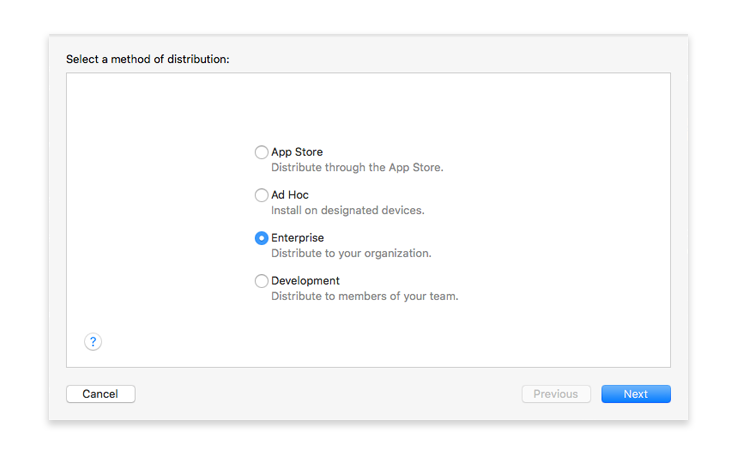
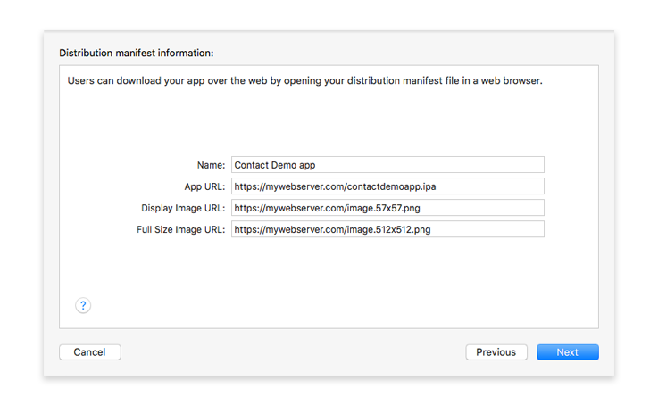
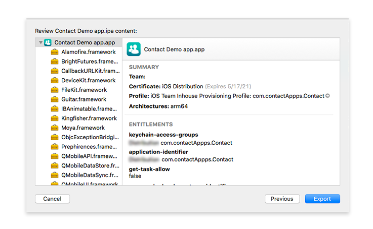

> **OBJETIVOS**
> 
> * Arquivar e exportar seu projeto 4D for iOS
> * Gerar .ipa e manifestar arquivos

> **PRÉ-REQUISITOS**
> 
> * [Programa Apple Enterprise Developer](../tutorials/developer-program/register-apple-developer-enterprise-program)
> * Um servidor web seguro
> * Um ícone de resolução de 57 x 57 px
> * Um ícone de resolução 512 x 512 px


## PASSO 1. Configuração Xcode

Depois da validação de sua conta por Apple, abra Xcode e agregue sua conta de Apple Enterprise Developer em Preferences  > Accounts.

Xcode instalará automaticamente os elementos de provisão e certificados necessários.

## PASSO 2. Obtenha uma ID de Equipe

* Registre-se na sua Conta de Desenvolvedor Apple. Lá pode achar sua ID de membro de um Time ou Equipe.


## PASSO 3. Configure 4D for iOS

* Abra 4D for iOS

* Na aba SEÇÕES:

    * Geral: introduza seu Team ID.

    

    * Publicação: ingresse sua URL de produção (HTTPS é obrigatório para o lançamento).

* Na aba BUILD:
    * Criar e Executar: Crie seu projeto.

## PASSO 4. Abra seu projeto com Xcode

* Desde a aba BUILD do editor de projetos de 4D for iOS, clique em **Project > Abrir o projeto com Xcode**


## PASSO 5. Arquive seu projeto com Xcode

* Desde Xcode, vá ao menu de simulador e selecione **Generic iOS Device**


* Desde o menu, clique em  Product e selecione **Archive**


## PASSO 6. Exporte seu projeto

* No final do processo de arquivo, aparece a janela do Organizador com o arquivo que acaba de criar

* Clique em **Exportar**.


## PASSO 7. Selecione seu método de distribuição

* Selecione **Enterprise** e clique em **Next**.



## PASSO 8. Selecione as opções de distribuição de sua empresa

* Pode deixar todas as caixas de opção marcadas.


* Pode deixar que o Xcode gere um arquivo manifest.plist para você ou gerá-lo manualmente.

* clique em **Next**.

#### O que é um manifesto?

O manifesto é uma lista de propriedades baseada em XML e deve conter:

* **URL**: URL que aponta ao arquivo .ipa.
* **display-image**: URL que aponta a um ícone PNG de 57 x 57 px (72 x 72 px para iPad) utilizado durante a descarga e a instalação.
* **full-size-image**: URL que aponta a uma imagem PNG de 512 x 512 px que representa a aplicação iTunes.
* **bundle-identifier**: a string de identificação de sua aplicação. Pode obtê-lo desde o arquivo  .plist de seu app.
* **bundle-version**: a string da versão atual do pacote de sua aplicação. Pode obtê-lo desde o arquivo  .plist de seu app.
* **title**: o nome de sua aplicação

Aqui há um exemplo de arquivo manifest.plist:

```xml
<?xml version="1.0" encoding="UTF-8"?>
<!DOCTYPE plist PUBLIC "-//Apple//DTD PLIST 1.0//EN" "http://www.apple.com/DTDs/PropertyList-1.0.dtd">
<plist version="1.0">
<dict>
    <key>items</key>
    <array>
        <dict>
            <key>assets</key>
            <array>
                <dict>
                    <key>kind</key>
                    <string>software-package</string>
                    <key>url</key>
                    <string>https://... Contact.ipa</string>
                </dict>
                <dict>
                    <key>kind</key>
                    <string>display-image</string>
                    <key>url</key>
                    <string>https://... Contact_icon_57.png</string>
                </dict>
                <dict>
                    <key>kind</key>
                    <string>full-size-image</string>
                    <key>url</key>
                    <string>https://... Contact_icon_512.png</string>
                </dict>
            </array>
            <key>metadata</key>
            <dict>
                <key>bundle-identifier</key>
                <string>com.contactApp. ContactDemoapp</string>
                <key>bundle-version</key>
                <string>1.0</string>
                <key>kind</key>
                <string>software</string>
                <key>title</key>
                <string>Contact Demo app</string>
            </dict>
        </dict>
    </array>
</dict>
</plist>
```


## PASSO 9. Informação sobre a distribuição do manifesto

* Recomendamos deixar que Xcode faça o trabalho de entrar sua URL de app assim como as URLs de ícones. Você pode mudar as URLs depois.



* clique em **Next**.


## PASSO 10. Volte a assinar sua aplicação

* Deixe que Xcode administre a opção **Automatically manage signing**.


* clique em **Next**.

## PASSO 11. Verifique o conteúdo do .ipa de sua aplicação

* Aqui pode verificar se o identificador de sua aplicação está correto, assim como a ID de Time.



* Clique em **Export** e selecione aonde salvar a pasta de sua aplicação em seu computador.
