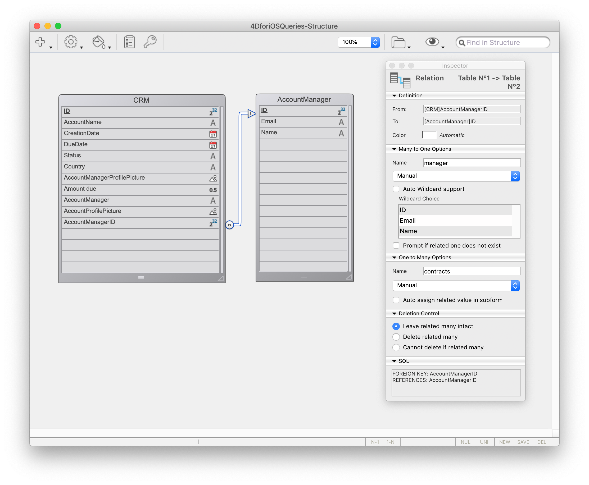
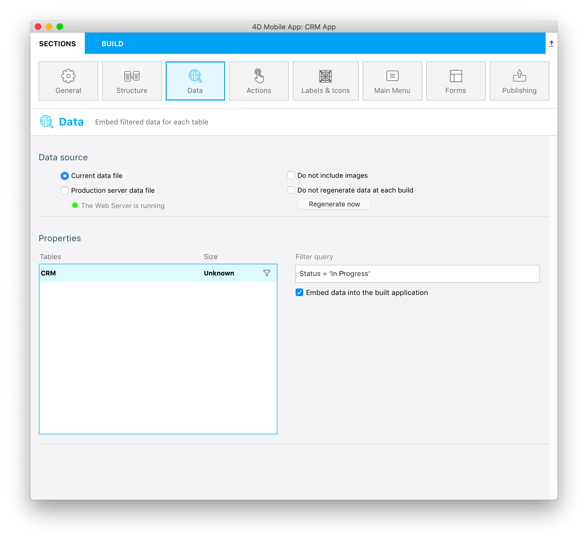

In this tutorial, we'll show how to create [**filter queries**](../../project-definition/data.md#filter-queries) to display filtered content in the generated mobile app.

Se você for um gestor de contas e quiser consultar seus contratos *Em curso* simplesmente conectando-se a sua aplicação com seu endereço de correio eletrônico.

Primeiro, a partir da seção Dados, vamos definir um **filtro de pesquisa básico** para exibir apenas contratos *Em Progresso*. Depois vamos aplicar um **filtro baseado na informação de usuário** que depende do email do gerente de conta.

## Baixe o Starter Project

Antes de começar, tenha certeza de baixar o **Starter Project** que inclui um arquivo **4DforiOSQueries.4dbase** (um banco de dados demo com um projeto de app móvel pronto para usar)

<div className="center-button">
<a className="button button--primary"
href="https://github.com/4d-go-mobile/tutorial-RestrictedQueries/releases/latest/download/tutorial-RestrictedQueries.zip">Starter project</a>
</div>

The database includes:

* a **CRM table** with all the data we want to display in the generated iOS app
* an **AccountManager table** with basic information about the account managers (email and name).




You're now ready to define your first filter query.

Open the mobile project by clicking on **Open** > **Mobile Project...** and select **CRM app** > **project.4dmobileapp**.


## Definir un Filter Query

Por agora,  se construir o app Starter Project e digitar "michelle.simpson@mail.com" como o email de login (uma das contas de administrador), verá **todos os contratos e estados dos administradores** (*Closed* e *In Progress*).


As we discussed above, we want the account managers to access their *In Progress* contracts by logging into their mobile app with their email. Para fazer isso:

* Vá para a seção **Dados**
* Dê clique direito no campo **Filtro de pesquisa** para fazer com que apareçam os botões **Campos, Comparadores e Operadores**.
* Clique no botão **Campos** e selecione **Estado**.
* Clique no botão **Comparadores** e selecione **Igual a**.
* Como quer mostrar os contratos*abertos*, ingresse **Em progresso**
* Lembre de validar sua pesquisa clicando no botão **Validar** do contrário não poderá criar sua aplicação.

Deve obter este resultado:



> **NOTES**
> 
> * Um ícone **filter** é exibido à direita de cada tabela quando um filtro básico é aplicado.
> * Para esses tipos de filtros de pesquisa, pode escolher incorporar os dados no app ou carregar os dados depois do login, marcando a checkbox **Embed data into the built application** .
> * O tamanho será calculado na primeira compilação para poder visualizar o **tamanho de seus dados**.

Se construir seu app e digitar "michelle.simpson@mail.com" como o email de login, verá que todos os contratos *Em Progresso* serão exibidos no Simulator!


Não é bem o que esperávamos! What we want now is for each account manager to visualize only their own *In Progress* contracts, so let's complete our query.


## Filtro de pesquisa usuário

Now let's filter our app content [depending on a user information](../../project-definition/data.md#filter-queries-with-user-information), in this case, the account manager's login email address.

* Vá para a seção **Dados**.
* Dê um clique direito no campo  **Filtro de pesquisa** para que apareçam os **botões Campo, Comparadores e Operadores** .
* Clique no botão **Operadores** e selecione **AND**.
* Agora defina a informação de usuário que deseja obter do método de banco de dados, **:email**.
* Lembre de validar a pesquisa clicando no botão **Validate**. Do contrário não poderá criar sua aplicação.


```4d
Status = 'In Progress' & manager. Email = :email 
```

A pesquisa vai filtrar os dados dependendo do status de **In Progress** E do **endereço de email do gerente de conta** (acessível da tabela AccountManager graças a relação  *Many-to-One* no nome do gerente).

> **NOTA**
> 
> * Um  **ícone usuário** é mostrado à direita de cada tabela quando um filtro de informação de usuário é aplicado a ela.
> * As soon as a query is based on user information and validated, you need to edit the [`On Mobile app authentication method`](../../4d/on-mobile-app-authentication.md). Para fazer isso, dê um clique direito no botão **Edit authentication method** para abrir a janela de edição do método de banco de dados.

Adicione a linha abaixo no método de banco de dados:

```4d
$response.userInfo:=New object("email";$request.email)
```

Isso permite recuperar o endereço de email do login do gerente e exibir dados dependendo desse critério.


Agora, se construir seu app e entrar "michelle.simpson@mail.com" como email de login, vai achar todos os contratos de Michelle Simpson *"Em progresso"*.


