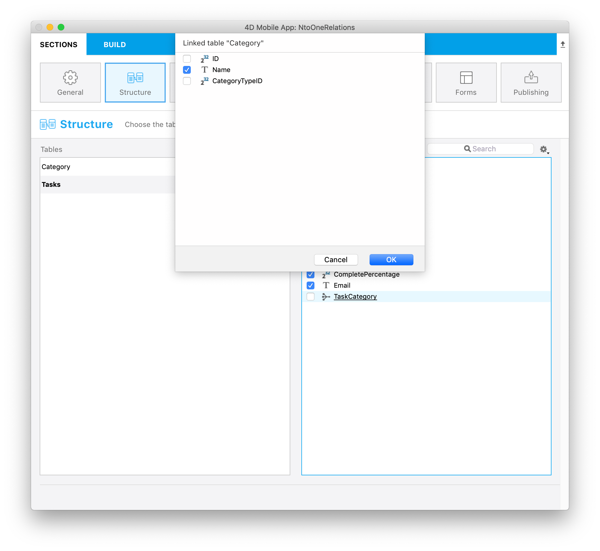

Este tutorial vai mostrar como é fácil incluir relações Muitos para Um em seu projeto móvel.

:::nota

Neste tutorial, vamos usar os nomes das relações entre suas tabelas. Dar nomes de relação bem descritivos ajuda a facilitar a definição de sua estrutura de projeto.

:::

Vamos começar baixando o Projeto Starter:

<a className="button button--primary" href="https://github.com/4d-go-mobile/tutorial-ManyToOneRelations/releases/latest/download/tutorial-ManyToOneRelations.zip">Starter project</a>

Aquí queremos mostrar la categoría de cada tarea en el formulario detallado de su aplicación generada. Para fazer isso, abra **StarteriOSProject** from **Open > Mobile Project...**

Depois vá para a seção Estrutura e selecione a **tabela Task**.

### Structure section

* Pode verificar que a **relação TaskCategory** está sublinhado

* Ao clicar nele, serão mostrados os campos disponíveis através dessa relação.

* Selecione o  **campo Name**

* Este campo funcionará como qualquer outro campo durante o resto do processo de criação da aplicação

* Pode também filtrar seu conteúdo de app usando campos relacionados da seção Data. Para fazer isso digite `TaskCategory. Name != 'Personal'` no campo Filter query para excluir as tarefas pessoais.

 

* Então pode selecionar um **ícone** assim como **formatadores** e definir **etiquetas curtas e longas** na seção Etiquetas e Ícones

* Vá para a seção Formulários e arraste o campo no formulário detalhado Tasks

* Build and Run

Seu campo relacionado deve aparecer no formulário detalhado do app!

