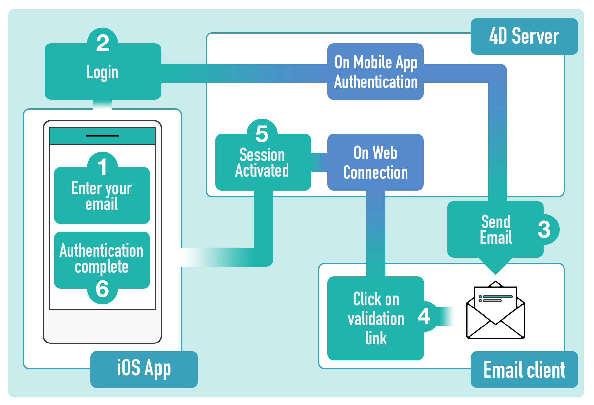

## Enabling authentication

A mobile application can require that the user be authenticated or not. 

- When authentication is not enabled, mobile users navigate in the application in Guest mode. 
- Once authentication is enabled, mobile users are asked to login before connecting to the application.  

:::info

In any cases, when a mobile user connects to the server, a [user session](session-management) is created.

:::


To enable authentication, check the **Authentication** option in the [Publishing](../project-definition/publishing) page:  


When this option is selected, the mobile app displays a [login form] at startup. A default login form is provided by the mobile editor, but you can design a custom login form.

The **Create...**/**Edit...** button opens the `On Mobile App Authentication` database method in the 4D method editor (see below). 


### On Mobile App Authentication database method

Using the [*On Mobile App Authentication*](https://doc.4d.com/4Dv19/4D/19/On-Mobile-App-Authentication-database-method.301-5392844.en.html) database method is mandatory to authorize specific emails or devices, even in Guest mode.

A method template is provided to obtain all necessary information about the session, as well as user information (email address, app information, device, team ID, etc.). You can customize this method according to your needs.

Here is the `On Mobile App Authentication` database method template:

```4d
// On Mobile App Authentication database method
// Default template

var $0 : Object
var $1 : Object

var $request; $response : Object

$request:=$1  // Information provided by mobile application
$response:=New object  // Information returned to mobile application

// Check user email
If ($request.email=Null)
	// No email means Guest mode - Allow connection
	$response.success:=True
Else 
	// Authenticated mode - Allow or not the connection according to email or other device property
	$response.success:=True //access allowed
	// to deny access :
	// $response.success:=False 
End if 

// Optional message to display on mobile App.
If ($response.success)
	$response.statusText:="You are successfully authenticated"
Else 
	$response.statusText:="Sorry, you are not authorized to use this application."
End if 

$0:=$response
```


## Email authentication

The most common and comfortable way to authenticate mobile users is to rely on email authentication.

It provides a way to verify that an email comes from whom it claims to be from, and will allow to block harmful or fraudulent uses of email.

### Overview

In short, the principle is the following:

#### 1. Enable authentication 

Select **Authentication** in the Publishing page to use a login form into your app. You can use the default login page or install a custom login page. 


#### 2. Enter email address

An email is required when the app is launched. When a user enters their email and clicks on the **Login** button, the `On Mobile App Authentication` is called and the user's session status should be updated to a "pending" status. A validation email is then sent to the user.

#### 3. Check mailbox and 4. Click on the link

When the validation email is available, the user only needs to click on the validation link. This will call the [`On Web Connection`](https://doc.4d.com/4Dv19/4D/19/On-Web-Connection-database-method.301-5392847.en.html) database method and update the [user's session](session-management.md) status from "pending" to "accepted".

#### 5. and 6. Back to the app

Once the validation is done, the user can reopen their app and click on the **Login** button. The `On Mobile App Authentication` method is called again but this time, the user's session status is "accepted", so the access is granted.

Here is a snapshot of the whole sequence:



You can handle this sequence using a special component, or manually. 


### Using the 4D Mobile App Server Component

The [4D Mobile App Server](https://github.com/4d-for-ios/4D-Mobile-App-Server/tree/master) component is a toolbox component developed to help you manage several common mobile features. It provides methods for authenticate email logins. 


1. Call the `Mobile App Email Checker` method from the `On Mobile App Authentication` database method with the information provided by the mobile application:

```4d
// On Mobile App Authentication database method

C_OBJECT($0)
C_OBJECT($1)
$0:= Mobile App Email Checker($1)
```

2. Call the `Mobile App Active Session` method from the `On Web Connection` database method with the `Session` ID parameter retrieved from the URL:

```4d
// On Web Connection database method

C_TEXT($1)
Case of 
: (Mobile App Active Session($1).success)
    //add log if you want
End case 

```

It's as simple as that!

You will find more information in the [Email Checker method documentation](https://github.com/4d-for-ios/4D-Mobile-App-Server/blob/master/Documentation/Methods/Mobile%20App%20Email%20Checker.md).


### Without the Component

You can implement your own email authentication without using the 4D Mobile App Server component. Here a basic example:

1. In the `On Mobile App Authentication` database method, write the following code:


```4d
// On Mobile App Authentication database method


C_OBJECT($0;$1;$response;$request;$email;$status)

  // parameters settings come from the mobile app
$request:=$1

  // Create an email with an activation URL
$mail:=New object
$mail.from:="myapplication@gmail.com"
$mail.to:=$request.email  // email entered by the user on their smartphone
$mail.subject:="Login confirmation"
$mail.htmlBody:="<a href=\"https://myserverapplication/activation/"+$request.session.id \
+"\">Click Here to confirm your email.</a>\"<br>"

  // Send mail
$smtp:=New object("host";"smtp.gmail.com";"user";"myapplication@gmail.com";"password";"xxx")
$transporter:=SMTP New transporter($smtp)
$status:=$transporter.send($mail)

  // Configure response for the mobile app
$response:=New object

  // Declare that the current session is being verified
$response.verify:=True

  // Check if the email was successsfully sent
If ($status.success)
	  //create a share object to contain our sessions, accessible from all processes
	If (Storage.pendingSessions=Null)
		Use (Storage)
			Storage.pendingSessions:=New shared object
		End use 
	End if 
	
	Use (Storage.pendingSessions)
		  //Add a session to our session lists
		Storage.pendingSessions[$request.session.id]:=$request.team.id+"."+$request.application.id
	End use 
	
	$response.success:=True
	$response.statusText:="Please check your mail box"
Else 
	  // Display an error message on the smatphone
	$response.statusText:="The mail is not sent please try again later"
	$response.success:=False
End if 

$0:=$response

```

2. In the `On Web Connection` database method, write some code to activate the session after the user clicked on the link in the confirmation email.

```4d
// On Web Connection database method

C_TEXT($1;$2;$3;$4;$5;$6)

C_TEXT($token;$session)
C_OBJECT($sessionFile;$sessionObject)

If ($1="/activation/@")
	$token:=Substring($1;13)
End if 


  //get session from ID received from URL
If (Storage.pendingSessions#Null)
	$session:=Storage.pendingSessions[$token]
End if 

If ($session#"")
	  //get session folder
	$sessionFile:=Folder(fk mobileApps folder).folder($session).file($token)
	$sessionObject:=JSON Parse($sessionFile.getText())
	  //update status value
	$sessionObject.status:="accepted"
	$sessionFile.setText(JSON Stringify($sessionObject))
	Use (Storage.pendingSessions)
		  //delete pending session
		OB REMOVE(Storage.pendingSessions;$token)
	End use 
	
	/*
		The MOBILE APP REFRESH SESSIONS command checks all mobile
		application session files located in the MobileApps folder of the server, 
		and updates existing session contents in memory for any edited files.
	*/

	MOBILE APP REFRESH SESSIONS
	
	WEB SEND TEXT("You are successfully authenticated")
Else 
	WEB SEND TEXT("Invalid session")
End if 
```

### Remote url definition

By default, a remote server URL is defined in your Android app. In case the URL is not correct, the server will not be accessible. Therefore, to modify or update this URL, just make a long pressure on the icon in the login screen, or from the settings tab.
Once you press the icon, a message is displayed with the remote url address and the server access status. You will then be able to edit the URL, authenticate successfully and access the server.

On iOS, you can edit the remote server URL from the iOS device Settings screen. You just need to check the "Reset server address" option to enter the correct server address.

