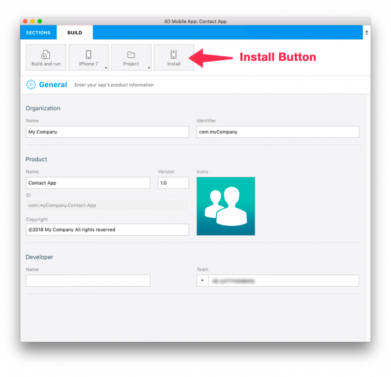
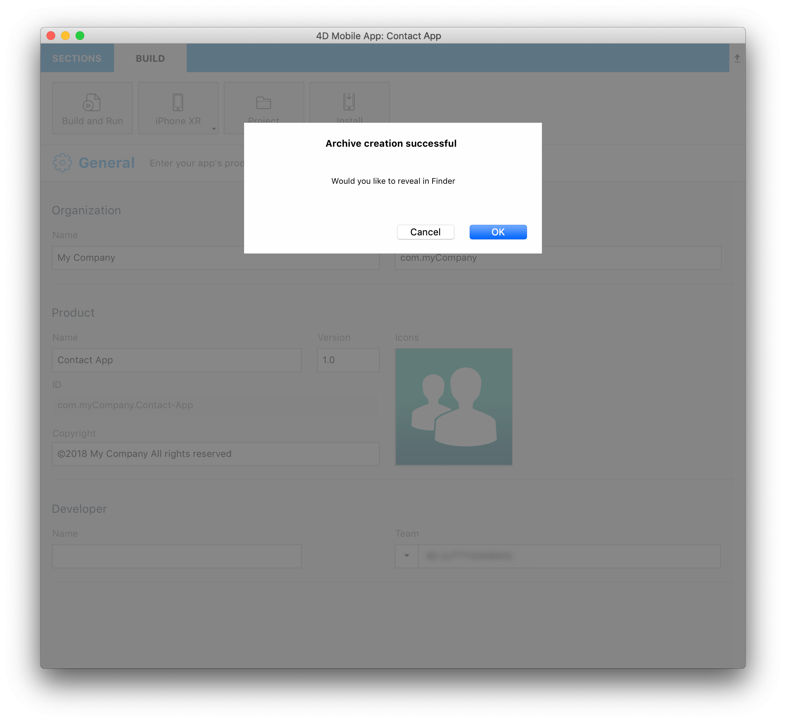

You can install and test your mobile application on a connected device. 


## Requirements

You need to subscribe to an Apple Developer Program. Depending on your objectives and preferences, you can choose to enroll in one of the following:

* [Free Apple Developer Program]```(free-developer-account.html)-- to add```: For testing only
* [Apple Developer Program for organization](../tutorials/developer-program/register-apple-developer-program-organization) or [individual](../tutorials/developer-program/register-apple-developer-program-individual): For an App Store Deployment
* [Apple Enterprise Developer Program](../tutorials/developer-program/register-apple-developer-enterprise-program): To deploy your app in-house


:::note

You need [Apple configurator 2](https://itunes.apple.com/us/app/apple-configurator-2/id1037126344) installed on your Mac to automate app installation (optional).

:::


## STEP 1. Account creation

* **Apple ID**: Create your Apple ID. If you don’t already have one, click [here](https://appleid.apple.com/account#!&page=create).  

* **Developer Account**: Choose an Apple Developer Program (for organizations or individuals) for App Store deployment or the Apple Developer Enterprise Program (for in-house deployment).

## STEP 2. Xcode configuration

* **Developer Account**: In Xcode > Preferences > Accounts, add your Apple ID.
 

## STEP 3. Get your Team ID

* If your are using a [Free Apple Developer Program]```(free-developer-account.html--to addd)``` go to [step 4](#step-4-team-id-for-free-account).
* If your are using an [Apple Developer Program for organization](../tutorials/developer-program/register-apple-developer-program-organization), [individual](../tutorials/developer-program/register-apple-developer-program-individual) or an [Apple Enterprise Developer Program](../tutorials/developer-program/register-apple-developer-enterprise-program) go to [step 5](#step-5-team-id-for-paid-subscription-account).

## STEP 4. Team ID for Free account

### Let Xcode generate your provisioning profile and certificate  

* Open your current project from the BUILD tab.

 

* Verify that the **Automatically manage signing** option is checked and select the account you added [here]```(free-developer-account.html)``` from the Team dropdown list.

 

* Connect your device to your computer and select it from the top menu in Xcode.

 

* Xcode automatically generates the necessary provisioning profiles and certificates you'll need to build your app.

### Build your project from Xcode using your Free Account

* Press the Build and run Button from Xcode !

 

## STEP 5. Team ID for paid subscription account

* **Team ID**: Go to Developer Account > Membership and get your Team ID.
 

* **4D for iOS**: Launch 4D for iOS in Sections > General and enter your Team ID.
 

* Go to STEP 6 to run your project on your device.

## STEP 6. Installation

### Install automatically with Apple Configurator 2

* When your app is ready, open the BUILD tab.
* Connect your device to your computer with a USB cable.
* From the BUILD tab, click on **Install**.

 

* The app is being installed on your device!

### Install manually using Xcode

* When your app is ready, open the BUILD tab.
* Connect your device to your computer with a USB cable.
* From the BUILD tab, click on **Install**.

 

* An archive of your project is created

 

* Reveal the generated archive in Finder

 

* Open Xcode and go to Menu > Window > Devices and Simulator and drag and drop the generated ipa file in the Installed Apps section.

 

* The app is now being installed on your device.


