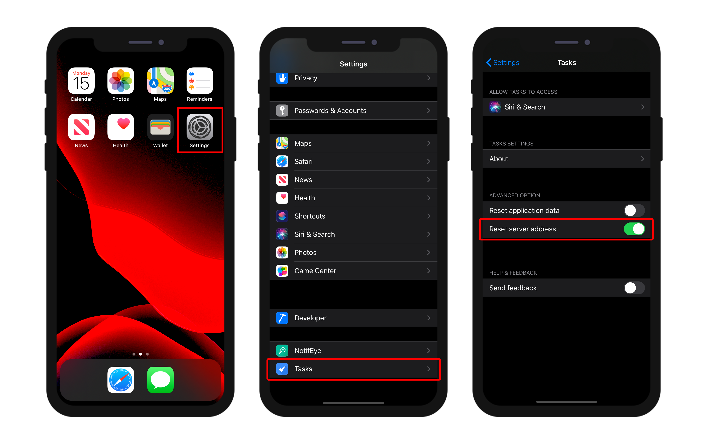

This page gives you access to your app's publishing settings and special mobile features:


## Production URL

URL of the Web Server on which mobile apps will connect to read and write data, in production context. You can enter any valid address, i.e.:

```
https://my.wesbsite.com
http://my.website.com:9200
www.website.com/mobile
```

During the development phase, you can leave this area empty and set the [Data source](data.md) to **Current data file**.

:::tip

The user will be able to [change the server url](#modify-remote-url) from the mobile device. 

:::


## Web Server Settings

The **Edit...** button opens the **Web** page of the 4D settings dialog box. Use this page to define the following settings to embed in the mobile app:

- **Enable HTTP** option and **HTTP port**.
- **Enable HTTPS** option and **HTTP port**.

:::note

If both HTTP and HTTPS are enabled, HTTP is used.

:::

Activating the HTTPS port requires that you installed a valid [TLS certificate](https://developer.4d.com/docs/en/Admin/tls.html). You can create test certificates with 4D.

These settings are taken into account only if the [production URL](#production-url) is defined. Otherwise, the local IP address is used.

:::note

The Simulator always works locally (127.0.0.1 or localhost).

::: 

## How it looks on a device

### Settings screen

A Settings screen is available from the tab bar. You can also find it from the More tab if necessary (*i.e.*, your app has more than four tables).

The Settings screen allows you to:

* Consult your remote URL and its current state
* Log out (if connected as an Authorized User)


### Modify remote url

You can easily update your remote url from iPhone Settings :

* Open your iPhone Settings
* Select the app you want the remote url to be updated
* Switch on the "Reset server address" option



* Then restart your app to reset the server address 
* And finally define the new remote url


## Features

This area allows you to select and configure several mobile app's special features. These features are documented in dedicated sections:

- [Authentication](../special-features/authentication.md)
- [Push notifications](../special-features/push-notification.md)
- [Deep linking](../special-features/deep-linking)


