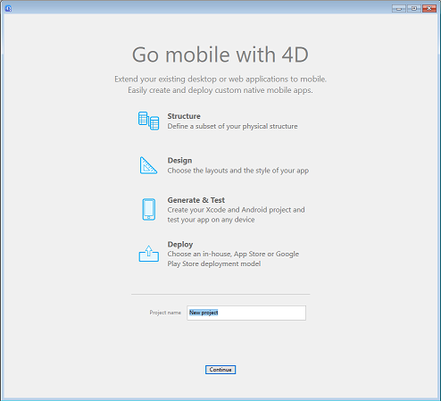
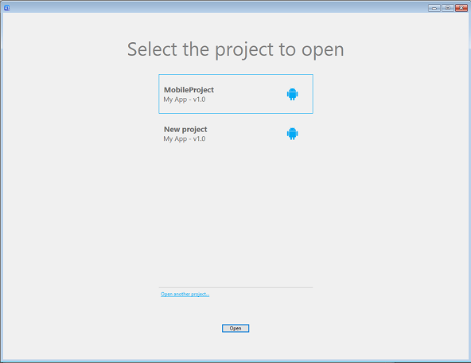

The 4D Mobile Project editor allows you to design, test, and build your native mobile projects for iOS and Android using a graphical interface. The window has two tabs: **Sections** and **Build**.

In the **Sections** tab, you'll find all of the necessary steps to create your mobile application:

* General
* Structure
* Data
* Actions
* Labels & Icons
* Main Menu
* Forms
* Publishing

In the **Build** tab, you'll find embedded tools to build and test you mobile app:

* Build and Run 
* Simulator selection
* Project and product browser
* Install 

The 4D Mobile Project editor is available from the **4D** application development environment (a 4D Developer Pro license is required). 

A 4D mobile project is strongly linked to a 4D data model. To be able to create or open a 4D mobile project, you must open the associated 4D project database beforehand.  

## Creating a mobile project

To create a new mobile project:

1. Start your 4D application and open the 4D project for which you want to create a mobile project.
2. Select **New > Mobile Project** from the **File** or the toolbar menu.

:::note

You need a 4D Developer Pro license to open the 4D mobile editor.

:::

The welcome dialog box is displayed:

3. Give your project a name and click **Continue**.

The Mobile project editor is displayed and the mobile file architecture is automatically created in your 4D project.  

## Opening a mobile project

To open a mobile project:

1. Start your 4D application and open the 4D project for which you want to open the mobile project.
2. Select **Open > Mobile Project** from the **File** or the toolbar menu.

The mobile project selection dialog box is displayed. It contains the list of mobile projects already defined for the current database:

The icon on the left side indicates if the project was created for Android, iOS, or both. 

3. Double-click on the project to open, or select the project and click **Open**.

### Open another project

The **Open another project...** link allows you to select any valid [`.4dmobileapp`](#mobile-project-architecture) file that is not listed in the dialog box.

:::warning

The selected mobile project must match the current data model, otherwise it will be updated and may not work as expected.

::: 

## Deleting a mobile project

To delete a mobile project, just remove the mobile project folder from the 4D project folder. 

## Mobile project architecture

Mobile projects are created inside the main 4D project folder:

- My4DProject (*main 4D project folder*)
	+ Mobile Projects
		* MyMobileProject
			- project.4dmobileapp
			- *other files and folders*

