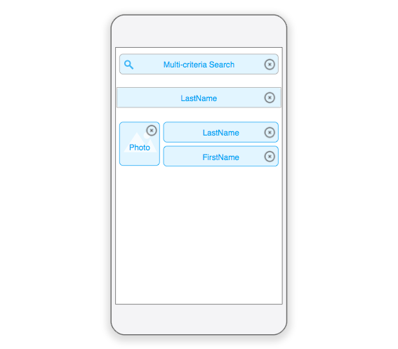

This section will show you how to activate the [multi-criteria search](../../project-definition/forms#multi-criteria-search) in your own templates.

:::info

The multi-criteria search feature is activated by default in all templates generated by the mobile editor.

:::

## Template svg file

To activate this feature in your own templates, you need to modify the following lines in your template.svg file from:

```xml
<rect id="search" class="droppable field optional" x="14" y="0" width="238" height="30" stroke-dasharray="5,2" ios:type="0,1,2,4,8,9,11,25,35" ios:bind="searchableField"/>

```

to:

```xml
<rect id="search" class="droppable field optional multi-criteria" x="14" y="0" width="238" height="30" stroke-dasharray="5,2" ios:type="0,1,2,4,8,9,11,25,35" ios:bind="searchableField"/>

```

There you go! The class is the only thing you need to modify for the multi-search criteria to be active.

## Project editor

Next, you can go to the project editor and drop several fields into the list form search area.



Click on the search field's delete button to modifiy the associated field list.

A menu will appear to allow you to **remove specific fields** or **remove all fields**, depending on which criteria you want to base your search(es) on.


Congratulations! You can now base your search(es) on multiple fields in your mobile app!
