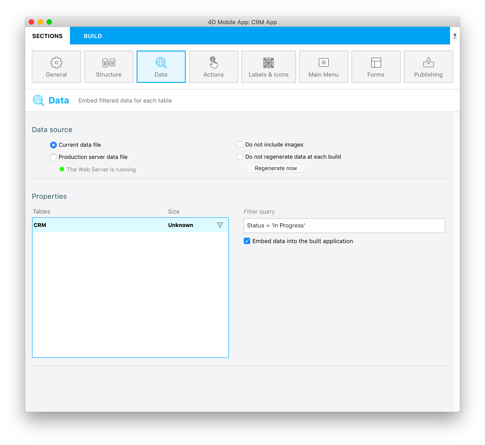

In this tutorial, we'll show how to create [**filter queries**](../../project-definition/data.md#filter-queries) to display filtered content in the generated mobile app.

Imagine you're an account manager and you want to consult your *In Progress* contracts simply by connecting to your app with your email address.

First, from the Data section we're going define a **basic filter query** to only display *In Progress* contracts. Then we're going to apply a **user information-based filter** which will depend on the account manager's email.

## Download the Starter project

Before we begin, be sure to download the **Starter project** which includes a **4DforiOSQueries.4dbase** file (a demo database with a ready-to-use mobile app project)

<div className="center-button">
<a className="button button--primary"
href="https://github.com/4d-go-mobile/tutorial-RestrictedQueries/releases/latest/download/tutorial-RestrictedQueries.zip">Starter project</a>
</div>


The database includes:

* a **CRM table** with all the data we want to display in the generated iOS app
* an **AccountManager table** with basic information about the account managers (email and name).


You're now ready to define your first filter query. 

Open the mobile project by clicking on **Open** > **Mobile Project...** and select **CRM app** > **project.4dmobileapp**.


## Define a Filter Query

For the moment, if you build the Starter project app and enter "michelle.simpson@mail.com" as the login email (one of the account managers), you'll see **all manager contracts and statuses** (*Closed* and *In Progress*).


As we discussed above, we want the account managers to access their *In Progress* contracts by logging into their mobile app with their email. To do this:

* Go to the **Data section**
* Right-click in the **Filter query** field to make the **Field, Comparators and Operators buttons** appear.
* Click on the **Fields** button and select **Status**.
* Click on the **Comparators** button and select **Equal to**.
* Because you want to display *open* contracts, enter **In progress**
* Remember to validate your query by clicking on the **Validate** button, otherwise you won't be able to build your app.

You should have this result:



> **NOTES**
>
> * A **filter** icon is displayed at the right of each table when a basic filter is applied to it.
> * For these kinds of filter queries, you can choose to embed data into the app or to load the data after login by checking the **Embed data into the built application** checkbox.
> * Size will be calculated at the first build for you to visualize the **size of your data**.

If you build your app and enter "michelle.simpson@mail.com" as the login email, you'll see that all contracts *In Progress* are displayed in the Simulator!


Not exactly what we expected! What we want now is for each account manager to visualize only their own *In Progress* contracts, so let's complete our query.


## User information query

Now let's filter our app content [depending on a user information](../../project-definition/data.md#filter-queries-with-user-information), in this case, the account manager's login email address. 

* Go to the **Data section**. 
* Right-click in the **Filter query** field to make **Field, Comparators and Operators buttons** appear.
* Click on the **Operators** button and select **AND**.
* Now define the user information you want to get from the database method, **:email**.
* Remember to validate the query by clicking on the **Validate** button. If not, you won't be able to build your app.


```4d
Status = 'In Progress' & manager.Email = :email 
```

The query will filter data depending on the **In Progress** status AND the **Account manager's email address** (accessible from the AccountManager table thanks to the *Many-to-One* relation on the manager's name).

> **NOTE**
>
>* A **user icon** is displayed on the right of each table when a user information filter is applied to it.
>* As soon as a query is based on user information and validated, you need to edit the [`On Mobile app authentication method`](../../4d/on-mobile-app-authentication.md). To do so, right-click on the **Edit authentication method** button to open the database method edition window.

Add the following line in the database method:

```4d
$response.userInfo:=New object("email";$request.email)
```

This will allow retrieving the manager's login email address and displaying data depending on that criteria.


Now if you build your app and enter "michelle.simpson@mail.com" as login email, you'll find all of Michelle Simpson's *"In progress"* contracts.


