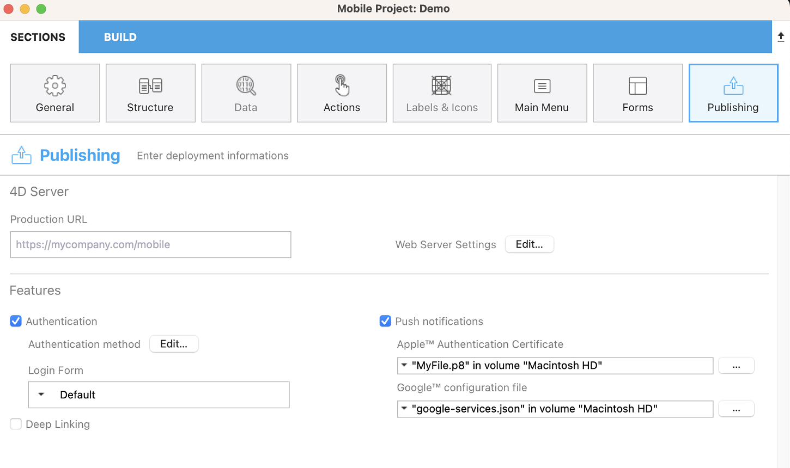
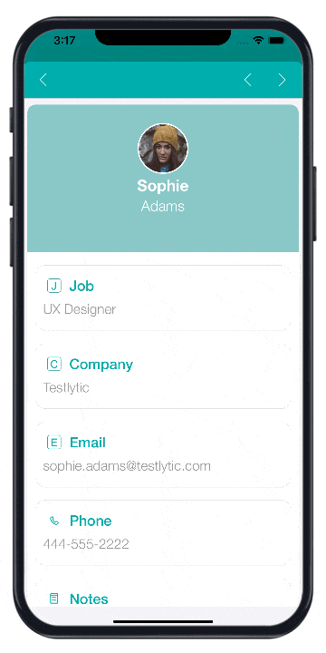

## What is a push notification?

On a mobile phone, a push notification is an alert message, received via an application, that you can open, delete, allow or block. It can be very useful for example to notify your app users that a new version is available.

But what about the architecture to implement, in order to integrate this functionality into a mobile application? And what is the process of a push notification, from creation to display on the user's mobile?

## Technical architecture

Here are the different elements needed to create, send and receive a mobile push notification (example with iOS):


## Configuration

In order to send push notifications, you need to generate and reference authentication and configuration files for your project. 

1. Generate and download your authentication files:

- **iOS**: Generate and download a `AuthKey_XXXYYY.p8` authentication key file as described in [this documentation](https://github.com/4d-for-ios/4D-Mobile-App-Server/blob/master/Documentation/Generate_p8.md).
- **Android**: Configure your Firebase project to get your `google-services.json` file and your `server key` as described in [this documentation](https://github.com/4d/4D-Mobile-App-Server/blob/main/Documentation/Conf_firebase.md).

2. In the [Publishing](../project-definition/publishing) page, check the **Push notifications** option and select appropriate files(s) for the mobile project:

- **iOS**: select the `.p8` file
- **Android**: select the `google-services.json` file




3. **Android only**: In the push notification method, reference the `server key` using the following statement:

```4d

$pushNotification.auth.serverKey:="your_server_key"

```


## Basic example to manage push notifications

The [4D Mobile App Server](https://github.com/4d/4D-Mobile-App-Server/tree/main) component provides methods to push notifications to one or multiple recipients. For detailed information, please refer to the [PushNotification component documentation](https://github.com/4d/4D-Mobile-App-Server/blob/main/Documentation/Classes/PushNotification.md).

Here is a simple example of push notification sent to `test@4d.com`:

```4d

$target:=New collection("ios";"android")
$pushNotification:=MobileAppServer.PushNotification.new("TEAM123456.com.sample.myappname";$target)
$pushNotification.auth.isDevelopment:=True //iOS only, to remove for production
$pushNotification.auth.serverKey:="your_server_key" //Android only
$notification:=New object 
$notification.title:="This is title" 
$notification.body:="Here is the content of this notification" 
$response:=$pushNotification.send($notification;"test@4d.com")

```

It's as simple as that!

:::tip

Use the [**4D Mobile App Server** component](https://github.com/4d/4D-Mobile-App-Server/blob/main/Documentation/Classes/PushNotification.md) to easily adapt the push notifications to your own needs. Feel free to use it and to pick the most relevant aspects for your app. And of course, all contributors are welcome to this project, through feedback, bug reports and even better: pull requests.

:::

## Push notification with data synchronization

With a push notification, you can also launch a synchronization to update your data.

For example, if your application has a delivery tracking option, the delivery information will be updated in the database thanks to a notification sent to the customer. This notification, containing a request to synchronize the data, will enable the customer to get the modified data on their smartphone.

To do so using the `4D Mobile App Server` component, you need to specify whether or not you want to force data synchronization in your push notification. Therefore, simply provide the `dataSynchro` boolean value in the `userInfo` object.

### Data synchronization with a notification opening a record

By default, a notification opening a record automatically triggers a data synchronization.

For example, in a Contact app, if a contact’s specific information (*i.e.* a contact’s record, such as the address or the phone number) has been modified, the user receives a notification that automatically opens the relevant record and synchronizes the data contained in the record. When the user opens the notification, the contact’s information is fully updated.

Here's an example of the default behaviour, a `dataSynchro` request with the `open()` method:

:::note

For `open()` method exclusively, this is the default behaviour. As a result, if you don't specify the `dataSynchro` boolean value, it is `true` by default.

:::

```4d

$target:=New collection("ios";"android")
$pushNotification:=MobileAppServer.PushNotification.new("TEAM123456.com.sample.myappname";$target)
$pushNotification.auth.isDevelopment:=True //iOS only
$pushNotification.auth.serverKey:="your_server_key" //Android only

$notification:=New object
$notification.title:="This is title" 
$notification.body:="Here is the content of this notification" 

$entity:=ds.Employees.get("456456")
$response:=$pushNotification.open($entity; $notification; $recipients)

```

However, you can also choose not to force a data synchronization, by preventing `dataSynchro`:

```4d

$target:=New collection("ios";"android")
$pushNotification:=MobileAppServer.PushNotification.new("TEAM123456.com.sample.myappname";$target)
$pushNotification.auth.isDevelopment:=True //iOS only
$pushNotification.auth.serverKey:="your_server_key" //Android only

$notification:=New object
$notification.title:="This is title" 
$notification.body:="Here is the content of this notification" 
$notification.userInfo:=New object("dataSynchro"; False)

$entity:=ds.Employees.get("456456")
$response:=$pushNotification.open($entity; $notification; $recipients)

```

### Data synchronization with a simple notification

You can also request a synchronization for a simple notification without opening a specific record. For example, some new entries have been added. You can then inform your user and update the data with no manipulation on their part.

Here is a code example that you can also use with other methods, as long as you fill the `userInfo` object with `dataSynchro` value.

```4d

$target:=New collection("ios";"android")
$pushNotification:=MobileAppServer.PushNotification.new("TEAM123456.com.sample.myappname";$target)
$pushNotification.auth.isDevelopment:=True //iOS only
$pushNotification.auth.serverKey:="your_server_key" //Android only

$notification:=New object
$notification.title:="This is title" 
$notification.body:="Here is the content of this notification" 
$notification.userInfo:=New object("dataSynchro"; True)

$response:=$pushNotification.send($notification; $recipients)

```


## Windows Configuration

Windows users need to download the [last CURL version](https://curl.se/download.html) to work on the variables of the environment of their machine. Or they can insert curl.exe in the Resources folder of their production database.

## MobileApps folder

Whether you're working on Windows or on macOS, you need to copy the following files from your development project to your production project:

- `4DBASE/MobileApps/ID.BundleID/AuthKey_XXXX.P8`
- `4DBASE/MobileApps/ID.BundleID/manifest.json`


