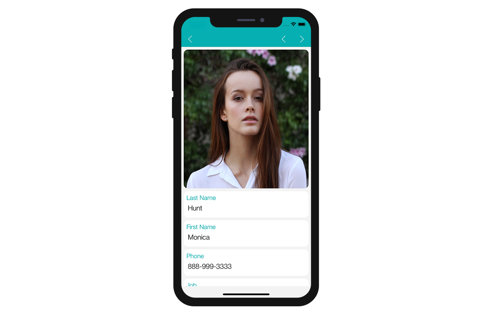
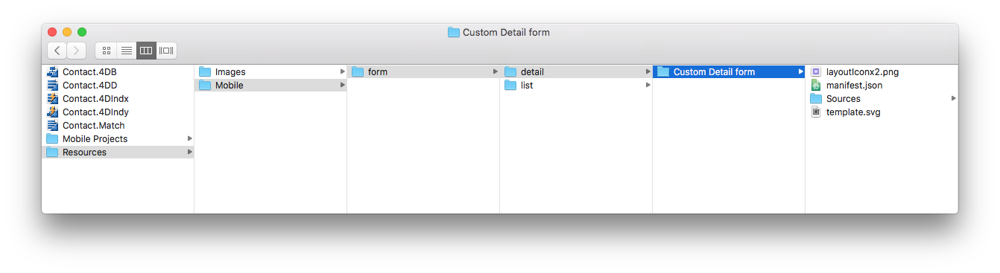

In this tutorial, we'll guide you through the creation of a detail form template. It will display an **image header**, as well as **title and content fields** that will be duplicated in the generated iOS and Android Apps.

## Download the Starter project

To begin, download the **Starter project**, which includes:

* A **Custom Detail form** folder (custom Detail form template folder)
* A demo 4D project ("Contact") with a ready to use mobile app project.

<a className="button button--primary"
href="https://github.com/4d-go-mobile/tutorial-CustomDetailFormStarter/archive/67c9c2f4672083e999a4a592a069d7ca45b3351e.zip">Starter project</a>

## Add a detail form template to your mobile project

First, create a *Contact.4dbase/Resources/Mobile/form/detail* folder and drag and drop the **Custom Detail form** folder in it.

Now, launch your 4D application and open the "Contact" 4D project. Then, select the "Contact Demo App" mobile project: **File > Open > Mobile Project > Contact Demo App**.

In the **Forms section** in the project editor, you can see that the Custom Detail form template has been successfully added to the Detail form template list:

Now let's focus on the **Custom Detail form** folder content.

## Detail form template folder content

In this folder, you will find:

* **a layoutIconx2.png** icon in 160x160px: displayed in the project editor when you select your custom template among others
* **a manifest.json** file: includes a basic description of the template
* **a template.svg** file: the representation of your template that will be display when you define your detailForm content and where you will drag and drop your fields
* an **ios folder** that includes the storyboard (graphical interface) and **Swift** file (code for the form) in `Source > Forms > Tables 'TABLE'` folder
* an **android folder** that includes the layout.xml file (graphical interface) in `app > src > main > res > layout` folder.

These files and folders are detailed in the next sections.